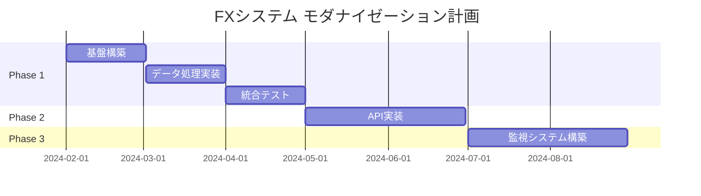

# FXシステム アーキテクチャ提案書

## 📋 概要

既存のExcel/VBA/MQL4システムを活かしながら、段階的にモダナイズするアーキテクチャ設計案です。

## 🏗️ 現在のシステム構造

### データフロー
```
MT4価格データ → CSV出力 → Excel処理 → PKG化 → 分岐探索 → 取引信号 → MT4 EA実行
```

### 主要コンポーネント
1. **MT4（MetaTrader 4）**
   - リアルタイム価格データ取得
   - EA（Expert Advisor）による取引実行

2. **Excel/VBA**
   - データ処理・指標計算の中核
   - PKGシステムによるデータ管理
   - 分岐探索による条件判定

3. **PKGシステム**
   - 191^ID形式でのデータパッケージ化
   - 条件の階層的管理

## 🎯 新アーキテクチャの目標

1. **既存資産の活用**: Excel/VBAロジックを維持
2. **段階的移行**: リスクを最小化した移行
3. **パフォーマンス向上**: データ処理の高速化
4. **拡張性**: 新機能追加の容易性
5. **監視強化**: リアルタイムモニタリング

## 📐 提案アーキテクチャ

### Phase 1: データ処理層の分離（3ヶ月）

```
┌─────────────────────────────────────────┐
│         既存システム（維持）             │
│  ├─ Excel UI（設定・手動操作）         │
│  └─ MT4 EA（取引実行）                 │
└─────────────────┬───────────────────────┘
                  │
┌─────────────────┴───────────────────────┐
│      新規データ処理サービス              │
│  ├─ Python計算エンジン                  │
│  ├─ PostgreSQL（時系列DB）             │
│  └─ Redis（キャッシュ）                │
└─────────────────────────────────────────┘
```

#### 実装例
```python
# データ処理の並行実行
class HybridDataProcessor:
    def __init__(self):
        self.excel_bridge = ExcelBridge()
        self.new_processor = ModernProcessor()
    
    def process(self, data):
        # 既存Excel処理と新処理を並行実行
        excel_result = self.excel_bridge.process(data)
        new_result = self.new_processor.process(data)
        
        # 結果を照合してログ
        self.validate_results(excel_result, new_result)
        
        # 移行期間中はExcel結果を使用
        return excel_result
```

### Phase 2: APIゲートウェイ導入（2ヶ月）

```
┌─────────────────────────────────────────┐
│           APIゲートウェイ                │
│  ├─ REST API（設定・履歴）             │
│  ├─ WebSocket（リアルタイム）          │
│  └─ メッセージキュー                    │
└─────────────────────────────────────────┘
```

### Phase 3: 分析・監視強化（2ヶ月）

```
┌─────────────────────────────────────────┐
│         分析・監視システム               │
│  ├─ リアルタイムダッシュボード         │
│  ├─ アラート通知                       │
│  └─ パフォーマンス分析                 │
└─────────────────────────────────────────┘
```

## 🔧 技術スタック

### バックエンド
- **Python 3.9+**: データ処理、分析
- **FastAPI**: REST API
- **PostgreSQL + TimescaleDB**: 時系列データ
- **Redis**: キャッシュ、セッション
- **RabbitMQ**: 非同期メッセージング

### インフラ
- **Docker**: コンテナ化
- **Docker Compose**: ローカル開発
- **GitHub Actions**: CI/CD

## 📊 PKGシステムのDB設計

```sql
-- PKGテーブル
CREATE TABLE packages (
    id VARCHAR(20) PRIMARY KEY,  -- 191^ID658833^1 形式
    root_id VARCHAR(20),         -- 191^1-5958 形式
    name VARCHAR(100),
    timeframe VARCHAR(10),
    symbol VARCHAR(10),
    created_at TIMESTAMP,
    data JSONB
);

-- 分岐条件テーブル
CREATE TABLE branch_conditions (
    id SERIAL PRIMARY KEY,
    package_id VARCHAR(20) REFERENCES packages(id),
    condition_type VARCHAR(50),
    condition_value JSONB,
    created_at TIMESTAMP
);

-- インデックス
CREATE INDEX idx_packages_timeframe ON packages(timeframe);
CREATE INDEX idx_packages_symbol ON packages(symbol);
CREATE INDEX idx_packages_created ON packages(created_at DESC);
```

## 🔄 移行計画

### Step 1: 基盤構築（1ヶ月目）
- [ ] Docker環境の構築
- [ ] PostgreSQL/Redisのセットアップ
- [ ] Python基本ライブラリの実装

### Step 2: データ処理移植（2-3ヶ月目）
- [ ] CSV読み込み処理の実装
- [ ] 指標計算ロジックの移植
- [ ] PKGシステムのDB化

### Step 3: 統合テスト（4ヶ月目）
- [ ] 既存システムとの結果照合
- [ ] パフォーマンステスト
- [ ] 負荷テスト

### Step 4: 段階的切り替え（5-6ヶ月目）
- [ ] 一部通貨ペアでの試験運用
- [ ] 全通貨ペアへの展開
- [ ] 旧システムの段階的停止

## ⚡ パフォーマンス目標

- **データ処理速度**: 現行比 10倍以上
- **メモリ使用量**: 現行比 50%削減
- **同時処理可能通貨ペア数**: 10以上
- **レスポンス時間**: < 100ms（95パーセンタイル）

## 🛡️ リスク管理

### フェイルセーフ機構
```python
class FailsafeManager:
    def execute_with_fallback(self, operation):
        try:
            # 新システムで実行
            return self.new_system.execute(operation)
        except Exception as e:
            # エラー時は既存システムにフォールバック
            self.logger.error(f"Falling back to Excel: {e}")
            return self.excel_system.execute(operation)
```

### 監視項目
1. **システムヘルス**: 各コンポーネントの稼働状況
2. **データ整合性**: 新旧システムの計算結果比較
3. **パフォーマンス**: 処理時間、メモリ使用量
4. **取引実績**: 約定率、スリッページ

## 📈 期待効果

1. **処理速度**: 10倍以上の高速化
2. **信頼性**: 99.9%以上の稼働率
3. **拡張性**: 新指標の追加が容易
4. **保守性**: コードの可読性向上
5. **監視**: リアルタイムでの状況把握

## 🗓️ タイムライン



---

最終更新日：2025年1月4日