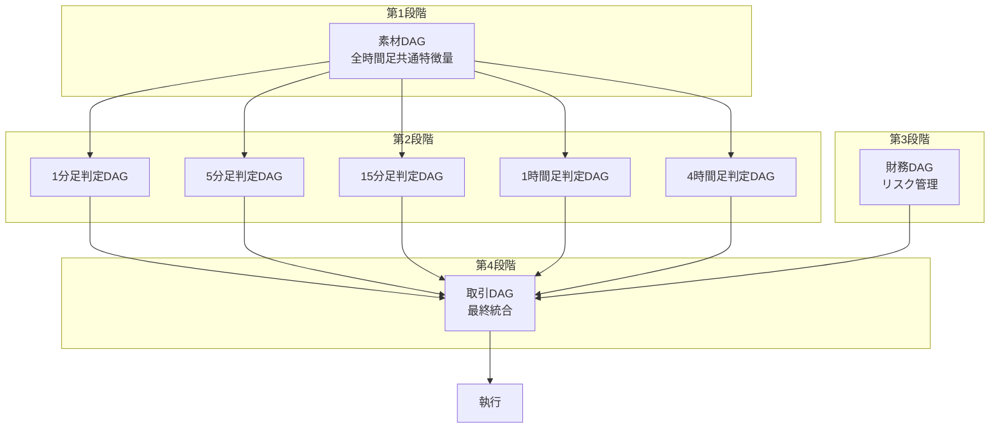

# PKG DAGアーキテクチャ総合ガイド

## 📚 ドキュメント体系

このドキュメントは、PKG DAGアーキテクチャ全体の概要と、詳細ドキュメントへのガイドです。

## 1. アーキテクチャ概要

### 1.1 PKG（Package）システムとは

PKGシステムは、FX取引判断を**関数型DAG（有向非巡環グラフ）**として実装したアーキテクチャです。

**特徴:**
- 純粋関数による決定論的評価
- 階層的なID体系
- ステートレス実行
- 並列処理可能

### 1.2 ID体系

```
[時間足][周期][通貨]^[階層]-[連番]
例: 391^2-126
  3 = 15分足
  9 = 周期なし
  1 = USDJPY
  2 = 階層2
  126 = 連番
```

## 2. DAGアーキテクチャの階層

### 2.1 全体構成（4段階DAG）



### 2.2 各DAGの詳細

| DAG種別 | 目的 | 変更頻度 | 詳細ドキュメント |
|---------|------|----------|-----------------|
| **素材DAG** | 特徴量抽出 | 低（安定層） | [pkg-dual-dag-architecture.md](./pkg-dual-dag-architecture.md) |
| **判定DAG群** | 時間足別判定 | 高（探索層） | [pkg-multi-timeframe-trading-architecture.md](./pkg-multi-timeframe-trading-architecture.md) |
| **財務DAG** | リスク管理 | 中 | [pkg-multi-timeframe-trading-architecture.md](./pkg-multi-timeframe-trading-architecture.md#3-財務dagの設計) |
| **取引DAG** | 統合判断 | 中 | [pkg-multi-timeframe-trading-architecture.md](./pkg-multi-timeframe-trading-architecture.md#4-取引dag最終統合の設計) |

## 3. 重要な設計原則

### 3.1 PKG DAGの厳密なルール

⚠️ **必ず守るべきルール:**

1. **横参照の禁止**
   - 同じ階層内のノード間参照は禁止
   - 参照は必ず下位階層のみ

2. **階層の深さ**
   - 3-4層で終わりではない
   - 数十層〜数百層になることも普通

3. **ノード数**
   - 各階層に100個以上のノードも可能
   - 連番は数百まで拡張可能

**詳細:** [pkg-dag-architecture-rules.md](./pkg-dag-architecture-rules.md)

### 3.2 素材DAGと判定DAGの分離

| 側面 | 素材DAG | 判定DAG |
|------|---------|---------|
| **目的** | データ品質と特徴量 | 収益最大化 |
| **変更理由** | データソース追加、品質改善 | バックテスト結果による最適化 |
| **変更頻度** | 月1回程度 | 日次〜週次 |
| **最適化** | なし（品質基準のみ） | グリッドサーチ、ベイズ最適化等 |

**詳細:** [pkg-dual-dag-architecture.md](./pkg-dual-dag-architecture.md)

## 4. AIエージェントの活用方針

### 4.1 正しい使い方と間違った使い方

| ✅ 正しい使い方 | ❌ 間違った使い方 |
|----------------|------------------|
| DAG構造の探索提案 | 取引判断の実行 |
| パラメータ範囲の提案 | リアルタイム市場分析 |
| ノード追加/削除の提案 | ポジションサイジング決定 |
| バックテスト設定の提案 | 実際の売買シグナル生成 |

### 4.2 フェーズの分離

```yaml
探索フェーズ（オフライン）:
  実行者: AIエージェント（Mastra等）
  タイミング: 週末、市場クローズ時
  役割: DAG構造の創造的探索

実行フェーズ（リアルタイム）:
  実行者: PKG DAG（決定論的）
  タイミング: 市場オープン時
  役割: 確定済みDAGによる取引判断
```

**詳細:** [pkg-dag-optimization-strategy.md](./pkg-dag-optimization-strategy.md)

## 5. 実装状況

### 5.1 実装済みコンポーネント

| コンポーネント | ファイル | 状態 |
|--------------|---------|------|
| PKG基本実装 | `src/pkg/trading_signal_pkg.py` | ✅ 完了 |
| 統一ID体系 | `src/pkg/unified_pkg_system.py` | ✅ 完了 |
| 乖離関数 | `src/pkg/functions/kairi_functions.py` | ✅ 完了 |
| テストスイート | `test_pkg_trading_signal.py` | ✅ 完了 |

### 5.2 今後の実装予定

- [ ] マルチタイムフレーム判定DAG群
- [ ] 財務DAGの詳細実装
- [ ] 取引DAG（統合層）
- [ ] Mastraによる探索エージェント
- [ ] バックテスト最適化パイプライン

## 6. パフォーマンス目標

| 処理 | 目標時間 | 最大許容時間 |
|------|----------|-------------|
| 素材DAG | < 5ms | 10ms |
| 判定DAG（各） | < 10ms | 20ms |
| 財務DAG | < 5ms | 10ms |
| 取引DAG | < 10ms | 20ms |
| **合計** | **< 30ms** | **60ms** |

## 7. 関連ドキュメント一覧

### 7.1 アーキテクチャ設計

1. **[pkg-dag-architecture-rules.md](./pkg-dag-architecture-rules.md)**
   - PKG DAGの厳密なルール
   - 横参照禁止の詳細
   - 実装チェックリスト

2. **[pkg-dual-dag-architecture.md](./pkg-dual-dag-architecture.md)**
   - 素材DAGと判定DAGの分離設計
   - エクスポート/インポート契約
   - バックテストによる最適化戦略

3. **[pkg-multi-timeframe-trading-architecture.md](./pkg-multi-timeframe-trading-architecture.md)**
   - 4段階DAGアーキテクチャ
   - 時間足別判定DAGの設計
   - 財務DAGと取引DAGの詳細

4. **[pkg-dag-optimization-strategy.md](./pkg-dag-optimization-strategy.md)**
   - AIエージェントの活用方針
   - 探索と実行の分離
   - Mastraの実装例

### 7.2 システム設計

- [05-pkg-system-design.md](./05-pkg-system-design.md) - PKGシステム全体設計
- [01-system-overview-design.md](./01-system-overview-design.md) - システム概要
- [07-backtest-forward-test-optimization-design.md](./07-backtest-forward-test-optimization-design.md) - バックテスト設計

### 7.3 実装ガイド

- `src/pkg/README.md` - PKG実装ガイド（作成予定）
- `docs/02-operation-logic/` - オペレーションロジック詳細

## 8. よくある質問（FAQ）

### Q1: なぜDAGは深くなるのか？

**A:** 関数合成により、各階層で新しい抽象度の処理が追加されるため。単純な3-4層ではなく、実際には数十層〜数百層になります。

### Q2: 横参照がないとどうやって複雑な判定をするのか？

**A:** 下位階層の結果を上位階層で統合することで実現。MN関数やAND/OR関数で複数の下位ノードを参照し、統合判定を行います。

### Q3: AIエージェントはなぜ取引判断をしないのか？

**A:** 取引には決定論性（同じ入力→同じ出力）と高速性（< 30ms）が必要。AIエージェントは創造的探索に特化し、実行は決定論的DAGが担当します。

### Q4: 時間足ごとに判定DAGを分ける理由は？

**A:** 各時間足で異なる取引戦略（スキャルピング、スイング等）を実装し、それらを取引DAGで統合することで、柔軟で堅牢なシステムを実現します。

## 9. 用語集

| 用語 | 定義 |
|------|------|
| **PKG** | Package - 関数型DAGによる取引システム |
| **DAG** | Directed Acyclic Graph - 有向非巡環グラフ |
| **素材DAG** | Feature DAG - 特徴量抽出を行う安定層 |
| **判定DAG** | Decision DAG - 取引判定を行う探索層 |
| **財務DAG** | Financial DAG - リスク管理とポジションサイジング |
| **取引DAG** | Trading DAG - 全体を統合する最上位DAG |
| **横参照** | 同一階層内でのノード間参照（禁止） |
| **乖離（かいり）** | 実勢価格と平均足の基準線に対する位置の相違 |
| **同逆判定** | 前々足乖離による方向判断 |
| **もみ** | レンジ相場、値動きが狭い状態 |

## 10. 次のステップ

1. **短期（1-2週間）**
   - マルチタイムフレーム判定DAGの実装
   - 財務DAGの基本実装

2. **中期（3-4週間）**
   - 取引DAG（統合層）の実装
   - Mastraエージェントの構築

3. **長期（1-2ヶ月）**
   - バックテスト最適化パイプライン
   - 本番環境へのデプロイ

---

最終更新: 2025年1月
バージョン: 1.0.0

## 問い合わせ

技術的な質問は、各詳細ドキュメントを参照するか、プロジェクトリーダーにお問い合わせください。