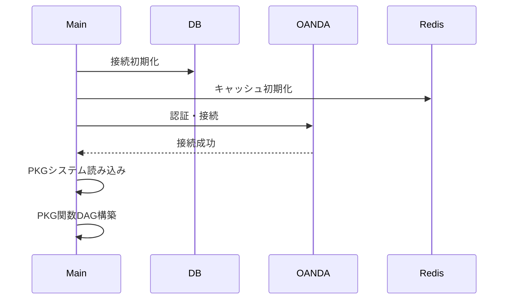
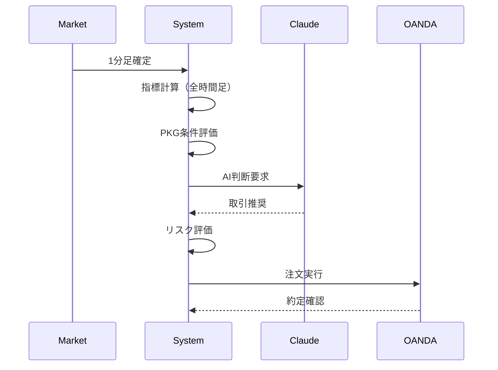

# FX取引システム 全体設計書

## 1. 概要

### 1.1 目的
本設計書は、既存の関数型DAGベースPKGシステムを基盤として、マルチタイムフレームAI統合型のFX自動取引システムを構築するための全体設計を定義する。

### 1.2 スコープ
- 対象通貨ペア：USD/JPY（初期実装）、将来的に3通貨まで拡張
- 時間足：1分、5分、15分（基準）、1時間
- AI判断頻度：1分足確定時
- ブローカー：OANDA v20 API

### 1.3 前提条件
- Python 3.11以上
- 24時間稼働可能な環境
- 安定したインターネット接続
- OANDA取引口座（デモ/本番）

## 2. システム構成

### 2.1 アーキテクチャ概要

```
┌─────────────────────────────────────────────────────┐
│               統合判断AIエージェント層                │
│  ┌────────────────────────────────────────────┐    │
│  │  Claude API統合エンジン（1分足判断）        │    │
│  │  - マルチタイムフレーム分析                 │    │
│  │  - 5大トレーダー財務戦略                    │    │
│  │  - ポートフォリオリスク評価                 │    │
│  └────────────────────────────────────────────┘    │
└──────────────────┬──────────────────────────────────┘
                   │
┌──────────────────┴──────────────────────────────────┐
│              取引ロジック層                          │
│  ┌──────────────────┐  ┌──────────────────┐      │
│  │  PKG関数型DAGシステム（191^ID形式）       │      │
│  │  - 階層的関数評価（191^/291^/391^）      │      │
│  └──────────────────┘  └──────────────────┘      │
│  ┌─────────────────────────────────────────────┐   │
│  │  指標計算エンジン（NumPy/Numba）             │   │
│  │  - OsMA（TSML周期別）                        │   │
│  │  - パラボリックSAR                           │   │
│  │  - 平均足・レンジ・同逆判定                  │   │
│  └─────────────────────────────────────────────┘   │
└──────────────────┬──────────────────────────────────┘
                   │
┌──────────────────┴──────────────────────────────────┐
│              データ基盤層                            │
│  ┌─────────────┐  ┌─────────────┐  ┌──────────┐  │
│  │ TimescaleDB  │  │ Redis       │  │ Event    │  │
│  │ (時系列DB)   │  │ (キャッシュ) │  │ Store    │  │
│  └─────────────┘  └─────────────┘  └──────────┘  │
└──────────────────┬──────────────────────────────────┘
                   │
┌──────────────────┴──────────────────────────────────┐
│              外部接続層                              │
│  ┌─────────────────┐  ┌──────────────────────┐    │
│  │ OANDA v20 API   │  │ Claude API         │    │
│  │ (取引実行)      │  │ (AI判断)          │    │
│  └─────────────────┘  └──────────────────────┘    │
└─────────────────────────────────────────────────────┘
```

### 2.2 コンポーネント詳細

#### 2.2.1 統合判断AIエージェント層
- **役割**：複数時間足のシグナルを統合し、最適な取引判断を行う
- **主要機能**：
  - 1分足確定時のClaude API呼び出し
  - マルチタイムフレーム分析（1分、5分、15分、1時間）
  - 5大トレーダー戦略の動的選択
  - ポートフォリオ全体のリスク評価

#### 2.2.2 取引ロジック層
- **PKGシステム**：
  - 191^ID形式での条件管理
  - 時間足別パッケージID割り当て
  - 分岐タイプ管理（基本、追加、ヘッジ、決済）
  
- **PKG関数評価エンジン**：
  - 階層的関数評価（191^基本層→291^中間層→391^統合層）
  - DAGトポロジカルソートによる依存関係解決
  - エントリー/エグジット条件の関数合成評価
  
- **指標計算エンジン**：
  - OsMA計算（TSML周期：10,15,30,45,60,90,180）
  - パラボリックSAR（5要素の加速判定）
  - 3桁FXコード体系

#### 2.2.3 データ基盤層
- **TimescaleDB**：時系列価格データの永続化
- **Redis**：リアルタイムデータキャッシング
- **Event Store**：JSONL形式での取引履歴保存

#### 2.2.4 外部接続層
- **OANDA v20 API**：リアルタイム価格取得、取引実行
- **Claude API**：AI判断（Anthropic API）

## 3. 機能要件

### 3.1 取引機能
- **エントリー条件**：
  - 同逆（前々足乖離）判定
  - 前足行帰判定
  - 今足なまし/先足なまし
  - 前足平均足転換
  - 10の上/下で方向合致

- **エグジット条件**：
  - 平均足転換
  - 足レンジ抜け
  - Pレンジ抜け
  - もみ抜け判定

- **ポジション管理**：
  - 最大ポジション数制限
  - ヘッジポジション管理
  - 追加エントリー制御

### 3.2 リスク管理機能
- **最大損失制限**：証拠金の15.98%（100pips）
- **レンジ管理**：
  - 足レンジ（短期境界）
  - 価格レンジ（サポート/レジスタンス）
  - 時間レンジ（長期トレンド）
- **5大トレーダー戦略**：
  - Lipschutz：相関VAR管理
  - PTJ：1%ルール + 5:1
  - Kovner：Stop先行サイジング
  - Soros：リフレクシビティ
  - Druckenmiller：流動性サイクル

### 3.3 データ管理機能
- **ヒストリカルデータ**：2005年以降のOANDAデータ
- **リアルタイムストリーミング**：レート制限なし
- **バックテスト**：イベントソーシングによる完全再現

## 4. 非機能要件

### 4.1 パフォーマンス要件
- **レイテンシー目標**：
  - Claude API応答：< 100ms
  - 指標計算：< 10ms
  - 取引実行：< 50ms
- **スループット**：
  - 同時監視通貨ペア：3ペア
  - 1分あたり処理数：最大180計算（3通貨×60秒）

### 4.2 可用性要件
- **稼働率**：99.5%以上（月間ダウンタイム3.6時間以内）
- **障害復旧**：自動再接続機能
- **データバックアップ**：日次自動バックアップ

### 4.3 セキュリティ要件
- **API認証**：環境変数での秘密情報管理
- **通信暗号化**：HTTPS必須
- **アクセス制御**：IPホワイトリスト

### 4.4 拡張性要件
- **水平スケーリング**：通貨ペア追加対応
- **戦略追加**：新規取引戦略のプラグイン化
- **AI モデル更新**：プロンプト変更での調整

## 5. システムフロー

### 5.1 初期化フロー


### 5.2 取引実行フロー


## 6. エラーハンドリング

### 6.1 接続エラー
- **OANDA API**：自動再接続（最大5回、指数バックオフ）
- **Claude API**：フォールバック（前回の判断を使用）
- **データベース**：接続プール管理

### 6.2 取引エラー
- **スリッページ**：許容範囲設定（デフォルト2pips）
- **リクオート**：再注文試行（最大3回）
- **証拠金不足**：ポジションサイズ自動調整

## 7. 監視項目

### 7.1 システムメトリクス
- CPU/メモリ使用率
- API応答時間
- エラー発生率

### 7.2 取引メトリクス
- 勝率/損益率
- 最大ドローダウン
- シャープレシオ

### 7.3 アラート条件
- 接続断
- 異常な価格変動
- 証拠金維持率低下

## 8. 用語集

- **PKG**：パッケージシステム、取引条件を管理する独自形式
- **TSML**：Tiny/Short/Middle/Long、期間分類
- **同逆**：同方向/逆方向の判定
- **もみ**：価格が狭いレンジで推移する状態
- **行帰**：価格の行きと帰りの動き

## 9. 参考資料

- FXコード体系仕様書
- PKGシステム仕様書
- PKG関数型DAGシステム仕様書
- OsMAパラメータ設定書
- レンジ分析総合ガイド

---

最終更新日：2025年1月4日
バージョン：1.0