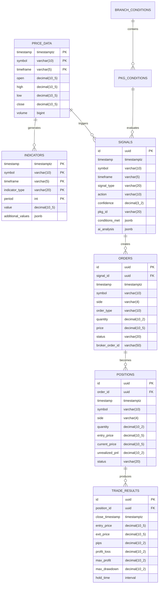

# FX取引システム データモデル設計書

## 1. 概要

### 1.1 目的
本設計書は、FX取引システムのデータベース構造、データモデル、およびデータ管理方針を定義する。

### 1.2 スコープ
- TimescaleDBによる時系列データ管理
- Redisによるリアルタイムキャッシュ
- イベントストア（JSONL形式）
- データ保持ポリシー

### 1.3 前提条件
- TimescaleDB 2.0以上
- Redis 6.0以上
- UTF-8エンコーディング
- タイムゾーン：UTC（表示時にJSTへ変換）

## 2. データベース設計

### 2.1 ER図



### 2.2 テーブル定義

#### 2.2.1 price_data（価格データ）
```sql
CREATE TABLE price_data (
    timestamp TIMESTAMPTZ NOT NULL,
    symbol VARCHAR(10) NOT NULL,
    timeframe VARCHAR(5) NOT NULL,
    open DECIMAL(10,5) NOT NULL,
    high DECIMAL(10,5) NOT NULL,
    low DECIMAL(10,5) NOT NULL,
    close DECIMAL(10,5) NOT NULL,
    volume BIGINT DEFAULT 0,
    PRIMARY KEY (timestamp, symbol, timeframe)
);

-- TimescaleDB hypertable化
SELECT create_hypertable('price_data', 'timestamp');

-- インデックス
CREATE INDEX idx_price_data_symbol_timeframe ON price_data (symbol, timeframe, timestamp DESC);
```

#### 2.2.2 indicators（技術指標）
```sql
CREATE TABLE indicators (
    timestamp TIMESTAMPTZ NOT NULL,
    symbol VARCHAR(10) NOT NULL,
    timeframe VARCHAR(5) NOT NULL,
    indicator_type VARCHAR(20) NOT NULL, -- 'OSMA', 'PARABOLIC', 'AVG_FOOT'
    period INT NOT NULL, -- TSML period (10,15,30,45,60,90,180)
    value DECIMAL(10,5) NOT NULL,
    additional_values JSONB, -- 追加データ（例：MACD line, signal line）
    PRIMARY KEY (timestamp, symbol, timeframe, indicator_type, period)
);

SELECT create_hypertable('indicators', 'timestamp');

CREATE INDEX idx_indicators_lookup ON indicators (symbol, timeframe, indicator_type, timestamp DESC);
```

#### 2.2.3 signals（取引シグナル）
```sql
CREATE TABLE signals (
    id UUID PRIMARY KEY DEFAULT gen_random_uuid(),
    timestamp TIMESTAMPTZ NOT NULL,
    symbol VARCHAR(10) NOT NULL,
    timeframe VARCHAR(5) NOT NULL,
    signal_type VARCHAR(20) NOT NULL, -- 'ENTRY', 'EXIT', 'HEDGE', 'ADD'
    action VARCHAR(10) NOT NULL, -- 'BUY', 'SELL', 'CLOSE'
    confidence DECIMAL(3,2) CHECK (confidence >= 0 AND confidence <= 1),
    pkg_id VARCHAR(20), -- 191^ID658833^1形式
    conditions_met JSONB, -- 満たした条件の詳細
    ai_analysis JSONB, -- Claude APIの分析結果
    created_at TIMESTAMPTZ DEFAULT CURRENT_TIMESTAMP
);

CREATE INDEX idx_signals_timestamp ON signals (timestamp DESC);
CREATE INDEX idx_signals_symbol ON signals (symbol, timestamp DESC);
```

#### 2.2.4 orders（注文）
```sql
CREATE TABLE orders (
    id UUID PRIMARY KEY DEFAULT gen_random_uuid(),
    signal_id UUID REFERENCES signals(id),
    timestamp TIMESTAMPTZ NOT NULL,
    symbol VARCHAR(10) NOT NULL,
    side VARCHAR(4) NOT NULL CHECK (side IN ('BUY', 'SELL')),
    order_type VARCHAR(10) NOT NULL DEFAULT 'MARKET',
    quantity DECIMAL(10,2) NOT NULL,
    price DECIMAL(10,5),
    slippage DECIMAL(5,2),
    status VARCHAR(20) NOT NULL DEFAULT 'PENDING',
    broker_order_id VARCHAR(50),
    error_message TEXT,
    created_at TIMESTAMPTZ DEFAULT CURRENT_TIMESTAMP,
    updated_at TIMESTAMPTZ DEFAULT CURRENT_TIMESTAMP
);

CREATE INDEX idx_orders_status ON orders (status, created_at DESC);
CREATE INDEX idx_orders_signal ON orders (signal_id);
```

#### 2.2.5 positions（ポジション）
```sql
CREATE TABLE positions (
    id UUID PRIMARY KEY DEFAULT gen_random_uuid(),
    order_id UUID REFERENCES orders(id),
    timestamp TIMESTAMPTZ NOT NULL,
    symbol VARCHAR(10) NOT NULL,
    side VARCHAR(4) NOT NULL,
    quantity DECIMAL(10,2) NOT NULL,
    entry_price DECIMAL(10,5) NOT NULL,
    current_price DECIMAL(10,5),
    unrealized_pnl DECIMAL(10,2),
    realized_pnl DECIMAL(10,2) DEFAULT 0,
    status VARCHAR(20) NOT NULL DEFAULT 'OPEN',
    stop_loss DECIMAL(10,5),
    take_profit DECIMAL(10,5),
    trailing_stop_distance DECIMAL(5,2),
    created_at TIMESTAMPTZ DEFAULT CURRENT_TIMESTAMP,
    updated_at TIMESTAMPTZ DEFAULT CURRENT_TIMESTAMP
);

CREATE INDEX idx_positions_status ON positions (status, symbol);
CREATE INDEX idx_positions_created ON positions (created_at DESC);
```

#### 2.2.6 trade_results（取引結果）
```sql
CREATE TABLE trade_results (
    id UUID PRIMARY KEY DEFAULT gen_random_uuid(),
    position_id UUID REFERENCES positions(id),
    close_timestamp TIMESTAMPTZ NOT NULL,
    entry_price DECIMAL(10,5) NOT NULL,
    exit_price DECIMAL(10,5) NOT NULL,
    pips DECIMAL(10,2) NOT NULL,
    profit_loss DECIMAL(10,2) NOT NULL,
    max_profit DECIMAL(10,2),
    max_drawdown DECIMAL(10,2),
    hold_time INTERVAL,
    win_loss VARCHAR(4) CHECK (win_loss IN ('WIN', 'LOSS')),
    strategy_used VARCHAR(50), -- 使用した戦略（Lipschutz, PTJ等）
    created_at TIMESTAMPTZ DEFAULT CURRENT_TIMESTAMP
);

CREATE INDEX idx_trade_results_timestamp ON trade_results (close_timestamp DESC);
CREATE INDEX idx_trade_results_win_loss ON trade_results (win_loss, close_timestamp DESC);
```

#### 2.2.7 pkg_conditions（PKG条件）
```sql
CREATE TABLE pkg_conditions (
    id VARCHAR(20) PRIMARY KEY, -- 191^ID658833^1形式
    package_name VARCHAR(100),
    timeframe VARCHAR(5),
    condition_type VARCHAR(50), -- 'ENTRY', 'EXIT', 'HEDGE', 'ADD'
    root_type INT, -- 0:通常, 1:末端, 2:状況, 3:再帰, 4:計算待機, 5:保持, 8:親階層探索終了
    conditions JSONB NOT NULL, -- 詳細な条件定義
    priority INT DEFAULT 0,
    is_active BOOLEAN DEFAULT true,
    created_at TIMESTAMPTZ DEFAULT CURRENT_TIMESTAMP,
    updated_at TIMESTAMPTZ DEFAULT CURRENT_TIMESTAMP
);

CREATE INDEX idx_pkg_conditions_active ON pkg_conditions (is_active, timeframe);
```

#### 2.2.8 branch_conditions（分岐条件）
```sql
CREATE TABLE branch_conditions (
    id SERIAL PRIMARY KEY,
    pkg_id VARCHAR(20) REFERENCES pkg_conditions(id),
    branch_name VARCHAR(100),
    branch_type VARCHAR(50), -- '基本', '追加', 'ヘッジ', '決済'
    evaluation_order INT,
    conditions JSONB NOT NULL,
    created_at TIMESTAMPTZ DEFAULT CURRENT_TIMESTAMP
);

CREATE INDEX idx_branch_conditions_pkg ON branch_conditions (pkg_id, evaluation_order);
```

### 2.3 Redisデータ構造

#### 2.3.1 リアルタイム価格
```
# 最新価格
price:{symbol}:{timeframe} = {
    "timestamp": "2025-01-04T10:00:00Z",
    "open": 150.123,
    "high": 150.456,
    "low": 150.000,
    "close": 150.234,
    "volume": 1000000
}

# TTL: 1時間
```

#### 2.3.2 計算済み指標キャッシュ
```
indicator:{symbol}:{timeframe}:{type}:{period} = {
    "timestamp": "2025-01-04T10:00:00Z",
    "value": 0.0234,
    "additional": {
        "macd": 0.123,
        "signal": 0.100,
        "histogram": 0.023
    }
}

# TTL: 5分
```

#### 2.3.3 アクティブポジション
```
position:active:{symbol} = [
    {
        "id": "uuid",
        "side": "BUY",
        "quantity": 10000,
        "entry_price": 150.123,
        "current_pnl": 23.45
    }
]

# TTL: なし（永続）
```

### 2.4 イベントストア（JSONL）

#### 2.4.1 ファイル構造
```
events/
├── 2025/
│   ├── 01/
│   │   ├── 2025-01-04.jsonl
│   │   ├── 2025-01-05.jsonl
│   │   └── ...
│   └── ...
```

#### 2.4.2 イベント形式
```json
{"timestamp":"2025-01-04T10:00:00.123Z","event_type":"PRICE_UPDATE","data":{"symbol":"USD_JPY","timeframe":"1M","price":{"open":150.123,"high":150.234,"low":150.100,"close":150.200}}}
{"timestamp":"2025-01-04T10:00:01.456Z","event_type":"SIGNAL_GENERATED","data":{"symbol":"USD_JPY","timeframe":"15M","signal":{"type":"ENTRY","action":"BUY","confidence":0.85,"pkg_id":"191^ID658833^1"}}}
{"timestamp":"2025-01-04T10:00:02.789Z","event_type":"ORDER_PLACED","data":{"signal_id":"uuid","order":{"side":"BUY","quantity":10000,"price":150.205}}}
```

## 3. インデックス設計

### 3.1 主要インデックス
```sql
-- 価格データの高速検索
CREATE INDEX idx_price_data_range ON price_data (symbol, timeframe, timestamp DESC);

-- 指標の最新値取得
CREATE INDEX idx_indicators_latest ON indicators (symbol, timeframe, indicator_type, period, timestamp DESC);

-- アクティブポジションの検索
CREATE INDEX idx_positions_active ON positions (status, symbol) WHERE status = 'OPEN';

-- 取引結果の集計
CREATE INDEX idx_trade_results_aggregation ON trade_results (symbol, win_loss, close_timestamp);
```

### 3.2 パーティショニング戦略

#### TimescaleDBの自動パーティショニング
```sql
-- 価格データ：1日単位
SELECT set_chunk_time_interval('price_data', INTERVAL '1 day');

-- 指標データ：1週間単位
SELECT set_chunk_time_interval('indicators', INTERVAL '1 week');
```

## 4. データ保持ポリシー

### 4.1 保持期間
| データ種別 | 保持期間 | 圧縮 | アーカイブ |
|-----------|---------|------|-----------|
| 価格データ（1分足） | 3ヶ月 | 1週間後 | S3へ移動 |
| 価格データ（その他） | 2年 | 1ヶ月後 | - |
| 指標データ | 6ヶ月 | 2週間後 | - |
| シグナル | 1年 | - | - |
| 取引結果 | 無期限 | - | - |
| イベントログ | 1年 | - | S3へ移動 |

### 4.2 圧縮ポリシー
```sql
-- 1週間以上前のデータを圧縮
SELECT add_compression_policy('price_data', INTERVAL '7 days');
SELECT add_compression_policy('indicators', INTERVAL '14 days');
```

### 4.3 データ削除ポリシー
```sql
-- 古いデータの自動削除
SELECT add_retention_policy('price_data', INTERVAL '3 months', 
    if_not_exists => true);
```

## 5. データアクセスパターン

### 5.1 書き込みパターン
- **価格データ**: 1秒間隔でバッチ挿入
- **指標計算**: 足確定時に一括計算・挿入
- **シグナル**: リアルタイム単発挿入
- **イベント**: 非同期でファイル追記

### 5.2 読み込みパターン
- **最新価格**: Redisから取得（キャッシュヒット率99%目標）
- **指標履歴**: 時間範囲指定でのバッチ取得
- **バックテスト**: 大量データの順次読み込み

## 6. バックアップとリカバリ

### 6.1 バックアップ戦略
```bash
# 日次バックアップ（深夜2時実行）
pg_dump -Fc -d fx_trading > backup/fx_trading_$(date +%Y%m%d).dump

# Redisバックアップ
redis-cli BGSAVE

# イベントログのS3同期
aws s3 sync events/ s3://fx-trading-backup/events/
```

### 6.2 リカバリ手順
1. TimescaleDBの復元
2. Redisデータの再構築
3. イベントログの再生
4. 整合性チェック

## 7. パフォーマンス考慮事項

### 7.1 クエリ最適化
- 時系列データは常に時間降順で取得
- JOINは最小限に抑える
- 集計はマテリアライズドビューを活用

### 7.2 接続プール設定
```yaml
database:
  max_connections: 100
  pool_size: 20
  timeout: 30s

redis:
  max_connections: 50
  pool_size: 10
  timeout: 5s
```

## 8. セキュリティ

### 8.1 アクセス制御
- 読み取り専用ユーザーの作成
- アプリケーション別の権限分離
- 監査ログの有効化

### 8.2 暗号化
- データベース接続のSSL必須
- 保存時の暗号化（AWS RDS）
- バックアップファイルの暗号化

---

最終更新日：2025年1月4日
バージョン：1.0