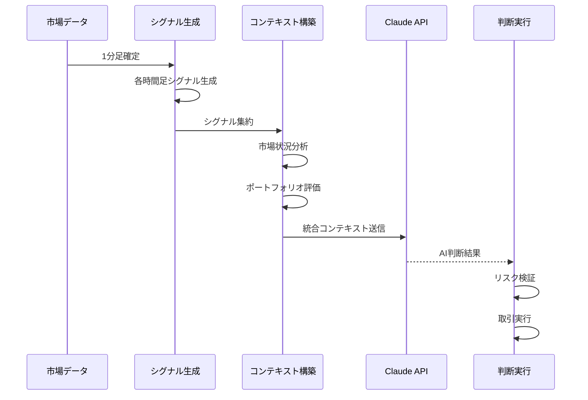

# FX取引システム AI統合設計書

## 1. 概要

### 1.1 目的
本設計書は、FX取引システムにおけるClaude APIを活用したAI統合の詳細設計を定義する。

### 1.2 スコープ
- Claude APIとの連携設計
- マルチタイムフレーム分析の統合
- 5大トレーダー戦略の実装
- AI判断プロセスの最適化
- 説明可能性と監査性

### 1.3 前提条件
- Claude API（Anthropic）アクセス
- 1分足での判断実行
- 3つの時間足（5分、15分、1時間）の統合
- PKGシステムによる確定的シグナル

## 2. AI統合アーキテクチャ

### 2.1 システム全体構成

```
┌─────────────────────────────────────────────────────┐
│             AI判断層（Claude API）                   │
│  ┌─────────────────────────────────────────────┐   │
│  │           統合判断エンジン                    │   │
│  │  ┌──────────┐  ┌──────────┐  ┌──────────┐ │   │
│  │  │ 時間足   │  │ 財務戦略 │  │ リスク   │ │   │
│  │  │ 統合     │  │ 選択     │  │ 評価     │ │   │
│  │  └──────────┘  └──────────┘  └──────────┘ │   │
│  └─────────────────────────────────────────────┘   │
│  ┌─────────────────────────────────────────────┐   │
│  │           プロンプトエンジニアリング          │   │
│  │  ┌──────────┐  ┌──────────┐  ┌──────────┐ │   │
│  │  │ コンテキスト│  │ 戦略選択 │  │ 判断生成 │ │   │
│  │  │ 構築      │  │ ロジック │  │ テンプレート│ │   │
│  │  └──────────┘  └──────────┘  └──────────┘ │   │
│  └─────────────────────────────────────────────┘   │
└──────────────────────┬──────────────────────────────┘
                      │
┌──────────────────────┴──────────────────────────────┐
│             シグナル集約層                           │
│  ┌──────────┐  ┌──────────┐  ┌──────────┐        │
│  │ 5分足    │  │ 15分足   │  │ 1時間足  │        │
│  │ シグナル │  │ シグナル │  │ シグナル │        │
│  └──────────┘  └──────────┘  └──────────┘        │
│  ┌─────────────────────────────────────────────┐   │
│  │          市場状況分析                        │   │
│  │  ・レンジ/トレンド判定                       │   │
│  │  ・ボラティリティ状態                       │   │
│  │  ・流動性評価                               │   │
│  └─────────────────────────────────────────────┘   │
└─────────────────────────────────────────────────────┘
```

### 2.2 AI判断フロー



## 3. プロンプトエンジニアリング

### 3.1 コンテキスト構築

#### 3.1.1 基本コンテキスト構造
```python
class AIContextBuilder:
    """AI判断用コンテキスト構築"""
    
    def build_trading_context(self, market_data: dict) -> dict:
        """取引判断用コンテキスト構築"""
        return {
            "timestamp": market_data["timestamp"],
            "instrument": market_data["instrument"],
            "timeframe_signals": self._build_timeframe_signals(market_data),
            "market_conditions": self._analyze_market_conditions(market_data),
            "portfolio_state": self._get_portfolio_state(),
            "risk_metrics": self._calculate_risk_metrics(),
            "economic_calendar": self._get_upcoming_events()
        }
    
    def _build_timeframe_signals(self, market_data: dict) -> dict:
        """時間足別シグナル構築"""
        signals = {}
        
        for timeframe in ["5M", "15M", "1H"]:
            signal = self.signal_generators[timeframe].generate(market_data)
            
            signals[timeframe] = {
                "action": signal.action,  # BUY/SELL/HOLD
                "strength": signal.strength,  # 0-1
                "conditions_met": signal.conditions_met,
                "pkg_id": signal.pkg_id,
                "indicators": {
                    "osma_tsml": signal.osma_values,
                    "parabolic": signal.parabolic_state,
                    "avg_foot": signal.avg_foot,
                    "range_position": signal.range_position
                }
            }
            
        return signals
```

#### 3.1.2 市場状況分析
```python
class MarketConditionAnalyzer:
    """市場状況の詳細分析"""
    
    def analyze_conditions(self, market_data: dict) -> dict:
        """市場状況を分析"""
        return {
            "trend_state": self._identify_trend_state(market_data),
            "volatility": self._calculate_volatility_metrics(market_data),
            "liquidity": self._assess_liquidity(market_data),
            "range_analysis": self._analyze_ranges(market_data),
            "momentum": self._calculate_momentum(market_data)
        }
    
    def _identify_trend_state(self, market_data: dict) -> dict:
        """トレンド状態の識別"""
        return {
            "primary_trend": self._get_primary_trend(),  # UP/DOWN/RANGE
            "trend_strength": self._calculate_trend_strength(),  # 0-1
            "trend_age": self._get_trend_duration(),  # bars
            "key_levels": self._identify_key_levels(),
            "trend_quality": self._assess_trend_quality()
        }
    
    def _analyze_ranges(self, market_data: dict) -> dict:
        """レンジ分析"""
        return {
            "foot_range": {
                "upper": market_data["foot_range_upper"],
                "lower": market_data["foot_range_lower"],
                "width": market_data["foot_range_width"],
                "position": market_data["price_position_in_range"]
            },
            "price_range": {
                "resistance": market_data["resistance_levels"],
                "support": market_data["support_levels"],
                "breakout_potential": self._calculate_breakout_probability()
            },
            "time_range": {
                "session": market_data["trading_session"],
                "historical_behavior": self._get_time_based_patterns()
            }
        }
```

### 3.2 プロンプトテンプレート

#### 3.2.1 基本判断プロンプト
```python
TRADING_DECISION_PROMPT = """
あなたはFX取引の専門AIアシスタントです。以下の市場データとシグナルを分析し、最適な取引判断を行ってください。

## 現在の市場状況
- 時刻: {timestamp}
- 通貨ペア: {instrument}
- 現在価格: {current_price}

## マルチタイムフレームシグナル
### 5分足（短期勢い）
- シグナル: {signals_5m.action} (強度: {signals_5m.strength})
- 条件: {signals_5m.conditions_met}
- OSMA状態: {signals_5m.indicators.osma_tsml}

### 15分足（基準）
- シグナル: {signals_15m.action} (強度: {signals_15m.strength})
- 条件: {signals_15m.conditions_met}
- レンジ位置: {signals_15m.indicators.range_position}

### 1時間足（トレンド）
- シグナル: {signals_1h.action} (強度: {signals_1h.strength})
- トレンド: {market_conditions.trend_state.primary_trend}

## ポートフォリオ状況
- 現在ポジション: {portfolio.positions}
- 証拠金使用率: {portfolio.margin_usage}%
- 未実現損益: {portfolio.unrealized_pnl}

## リスク評価
- 最大許容損失: {risk_metrics.max_loss}
- 現在のVaR: {risk_metrics.var}
- ドローダウン: {risk_metrics.drawdown}%

## 判断基準
1. 15分足を基準としつつ、5分足で勢いを確認、1時間足でトレンドを確認
2. リスク管理を最優先（証拠金の15.98%が上限）
3. 5大トレーダーの戦略から最適なものを選択

以下の形式で回答してください：
{{
  "action": "BUY/SELL/HOLD",
  "confidence": 0.0-1.0,
  "position_size": ロット数,
  "stop_loss": 価格,
  "take_profit": 価格,
  "strategy_used": "使用する戦略名",
  "reasoning": "判断理由の説明",
  "risk_assessment": "リスク評価"
}}
"""
```

#### 3.2.2 戦略選択プロンプト
```python
STRATEGY_SELECTION_PROMPT = """
現在の市場環境に基づいて、5大トレーダーの戦略から最適なものを選択してください。

## 利用可能な戦略
1. **Lipschutz戦略**: 相関VARベース、流動性重視
   - 適用条件: 複数通貨の相関が高い、G7イベント前後
   
2. **PTJ戦略**: 1%ルール、5:1リスクリワード、200MA
   - 適用条件: 明確なトレンド、高いR:R比が期待できる
   
3. **Kovner戦略**: ストップ先行、テクニカル障壁重視
   - 適用条件: 明確なサポート/レジスタンス、初心者向け
   
4. **Soros戦略**: リフレクシビティ、非対称性最大化
   - 適用条件: 市場の転換点、自己強化ループの兆候
   
5. **Druckenmiller戦略**: 流動性サイクル、集中投資
   - 適用条件: 中央銀行政策転換、年1-2回の大相場

## 現在の市場環境
{market_environment}

## ポートフォリオ状況
{portfolio_state}

最適な戦略を選択し、その理由を説明してください。
"""
```

### 3.3 5大トレーダー戦略実装

#### 3.3.1 Lipschutz相関VAR戦略
```python
class LipschutzCorrelationStrategy:
    """Bill Lipschutz: 相関ベースVAR管理戦略"""
    
    def __init__(self):
        self.correlation_threshold = 0.7
        self.var_limit = 0.03  # 3% VaR
        self.liquidity_factor = 0.5  # 低流動性時の削減率
        
    async def calculate_position(self, signal, portfolio, market) -> PositionSize:
        """相関を考慮したポジションサイズ計算"""
        
        # 1. 通貨ペア相関マトリクス
        correlations = await self._calculate_correlations(
            portfolio.get_active_symbols()
        )
        
        # 2. クラスター分析
        clusters = self._identify_correlation_clusters(correlations)
        
        # 3. クラスターVaR計算
        cluster_var = self._calculate_cluster_var(
            signal.symbol,
            clusters,
            portfolio
        )
        
        # 4. 流動性調整
        liquidity_score = await self._assess_liquidity(market)
        
        if liquidity_score < 0.5:  # G7イベント等
            adjustment_factor = self.liquidity_factor
        else:
            adjustment_factor = 1.0
            
        # 5. 最終ポジションサイズ
        available_risk = (self.var_limit * portfolio.nav) - cluster_var
        position_size = (available_risk / signal.stop_distance) * adjustment_factor
        
        return PositionSize(
            units=position_size,
            strategy="Lipschutz_Correlation_VAR",
            risk_adjusted=True
        )
```

#### 3.3.2 PTJ系統的リスク戦略
```python
class PTJSystematicStrategy:
    """Paul Tudor Jones: 1%ルール + 5:1戦略"""
    
    def __init__(self):
        self.base_risk = 0.01  # 1%ルール
        self.min_rr_ratio = 5.0  # 最小リスクリワード比
        self.ma_period = 200  # 200日移動平均
        
    async def calculate_position(self, signal, portfolio, market) -> PositionSize:
        """系統的リスク管理によるポジション計算"""
        
        # 1. 基本リスク計算
        risk_amount = portfolio.nav * self.base_risk
        
        # 2. 連敗調整
        consecutive_losses = portfolio.get_consecutive_losses()
        if consecutive_losses > 3:
            risk_amount *= (1 / math.sqrt(consecutive_losses))
            
        # 3. 200MA乖離チェック
        ma200 = await market.get_ma(self.ma_period)
        distance_from_ma = abs(market.price - ma200) / ma200
        
        if distance_from_ma > 0.05:  # 5%以上乖離
            risk_amount *= 0.5
            
        # 4. リスクリワード検証
        rr_ratio = signal.take_profit_distance / signal.stop_distance
        
        if rr_ratio < self.min_rr_ratio:
            return PositionSize(units=0, strategy="PTJ_Skipped_Low_RR")
            
        # 5. ポジションサイズ計算
        position_size = risk_amount / signal.stop_distance
        
        return PositionSize(
            units=position_size,
            strategy="PTJ_1Percent_Rule",
            rr_ratio=rr_ratio
        )
```

#### 3.3.3 Kovnerストップベース戦略
```python
class KovnerStopBasedStrategy:
    """Bruce Kovner: テクニカル障壁ベース戦略"""
    
    def __init__(self):
        self.risk_percentage = 0.015  # 1.5%
        self.half_rule_factor = 0.5  # 初心者は半分
        self.max_correlated_positions = 3
        
    async def calculate_position(self, signal, portfolio, market) -> PositionSize:
        """テクニカル障壁からのストップ設定"""
        
        # 1. テクニカル障壁の特定
        technical_levels = await self._identify_technical_barriers(
            market,
            signal.direction
        )
        
        # 2. 最適ストップ位置
        optimal_stop = self._select_optimal_stop(
            technical_levels,
            signal.entry_price,
            signal.direction
        )
        
        stop_distance = abs(signal.entry_price - optimal_stop)
        
        # 3. 基本サイズ計算
        base_size = (portfolio.nav * self.risk_percentage) / stop_distance
        
        # 4. "半分ルール"適用
        conservative_size = base_size * self.half_rule_factor
        
        # 5. 相関ポジション調整
        correlated_count = self._count_correlated_positions(
            portfolio,
            signal.symbol
        )
        
        if correlated_count >= self.max_correlated_positions:
            conservative_size *= (self.max_correlated_positions / (correlated_count + 1))
            
        return PositionSize(
            units=conservative_size,
            strategy="Kovner_Technical_Stop",
            stop_loss=optimal_stop
        )
```

#### 3.3.4 Sorosリフレクシビティ戦略
```python
class SorosReflexivityStrategy:
    """George Soros: リフレクシビティと非対称性"""
    
    def __init__(self):
        self.reflexivity_threshold = 0.8
        self.max_position_ratio = 0.5  # 最大50%
        self.pyramid_factor = 2.0  # 利益の2倍を追加
        
    async def calculate_position(self, signal, portfolio, market) -> PositionSize:
        """リフレクシビティに基づく大胆なポジショニング"""
        
        # 1. リフレクシビティスコア
        reflexivity = await self._calculate_reflexivity_score(market)
        
        # 2. 転換点の可能性
        if reflexivity > self.reflexivity_threshold:
            # 高確信度での大ポジション
            if signal.confidence > 0.9:
                size = portfolio.nav * self.max_position_ratio
            else:
                size = portfolio.nav * 0.2
                
            return PositionSize(
                units=size,
                strategy="Soros_Reflexivity_Breakout",
                conviction="HIGH"
            )
            
        # 3. ピラミッディング戦略
        existing_position = portfolio.get_position(signal.symbol)
        
        if existing_position and existing_position.unrealized_pnl > 0:
            # 利益の倍額を追加
            add_size = existing_position.unrealized_pnl * self.pyramid_factor
            max_add = portfolio.nav * 0.3
            
            return PositionSize(
                units=min(add_size, max_add),
                strategy="Soros_Pyramid_Addition"
            )
            
        # 4. 新規エントリーは控えめ
        return PositionSize(
            units=portfolio.nav * 0.02,
            strategy="Soros_Initial_Entry"
        )
```

#### 3.3.5 Druckenmiller流動性戦略
```python
class DruckenmillerLiquidityStrategy:
    """Stanley Druckenmiller: 流動性サイクル集中投資"""
    
    def __init__(self):
        self.max_annual_bets = 2
        self.concentration_ratio = 0.8  # 80%集中
        self.liquidity_threshold = 2.0  # 2σ
        
    async def calculate_position(self, signal, portfolio, market) -> PositionSize:
        """中央銀行流動性に基づく集中投資"""
        
        # 1. 流動性サイクル分析
        liquidity_score = await self._analyze_central_bank_liquidity()
        
        # 2. 年間ベット回数チェック
        annual_bets = await self._count_annual_concentration_bets()
        
        # 3. 流動性拡大期の大勝負
        if liquidity_score > self.liquidity_threshold:
            if annual_bets < self.max_annual_bets:
                # "Bet the ranch"モード
                await self._record_concentration_bet()
                
                return PositionSize(
                    units=portfolio.nav * self.concentration_ratio,
                    strategy="Druckenmiller_Liquidity_Expansion",
                    bet_type="CONCENTRATED"
                )
                
        # 4. 流動性縮小期
        elif liquidity_score < -1.0:
            return PositionSize(
                units=0,
                strategy="Druckenmiller_Risk_Off"
            )
            
        # 5. 通常期
        return PositionSize(
            units=portfolio.nav * 0.05,
            strategy="Druckenmiller_Normal"
        )
```

## 4. AI統合実装

### 4.1 Claude API連携

#### 4.1.1 API接続管理
```python
class ClaudeAPIManager:
    """Claude API接続管理"""
    
    def __init__(self):
        self.api_key = os.environ['ANTHROPIC_API_KEY']
        self.client = anthropic.Anthropic(api_key=self.api_key)
        self.model = "claude-3-opus-20240229"
        self.max_tokens = 4096
        self.temperature = 0.3  # 低めで一貫性重視
        
    async def get_trading_decision(self, context: dict) -> TradingDecision:
        """取引判断を取得"""
        
        # プロンプト構築
        prompt = self._build_prompt(context)
        
        try:
            # API呼び出し
            response = await self._call_api(prompt)
            
            # レスポンス解析
            decision = self._parse_response(response)
            
            # 検証
            validated = self._validate_decision(decision)
            
            return validated
            
        except Exception as e:
            logger.error(f"Claude API error: {e}")
            return self._get_fallback_decision(context)
    
    async def _call_api(self, prompt: str) -> str:
        """API呼び出し（リトライ付き）"""
        max_retries = 3
        
        for attempt in range(max_retries):
            try:
                message = self.client.messages.create(
                    model=self.model,
                    max_tokens=self.max_tokens,
                    temperature=self.temperature,
                    messages=[{
                        "role": "user",
                        "content": prompt
                    }]
                )
                
                return message.content[0].text
                
            except anthropic.RateLimitError:
                wait_time = (2 ** attempt) * 1
                await asyncio.sleep(wait_time)
            except Exception as e:
                if attempt == max_retries - 1:
                    raise
```

#### 4.1.2 レスポンス処理
```python
class AIResponseProcessor:
    """AIレスポンス処理"""
    
    def parse_trading_decision(self, response: str) -> TradingDecision:
        """取引判断のパース"""
        try:
            # JSON部分を抽出
            json_match = re.search(r'\{.*\}', response, re.DOTALL)
            if not json_match:
                raise ValueError("No JSON found in response")
                
            decision_data = json.loads(json_match.group())
            
            # 取引判断オブジェクト作成
            return TradingDecision(
                action=TradeAction(decision_data['action']),
                confidence=float(decision_data['confidence']),
                position_size=float(decision_data['position_size']),
                stop_loss=Decimal(str(decision_data['stop_loss'])),
                take_profit=Decimal(str(decision_data['take_profit'])),
                strategy_used=decision_data['strategy_used'],
                reasoning=decision_data['reasoning'],
                risk_assessment=decision_data['risk_assessment']
            )
            
        except Exception as e:
            logger.error(f"Failed to parse AI response: {e}")
            raise
    
    def validate_decision(self, decision: TradingDecision) -> bool:
        """判断の妥当性検証"""
        validations = [
            self._validate_position_size(decision),
            self._validate_stop_loss(decision),
            self._validate_risk_limits(decision),
            self._validate_strategy_consistency(decision)
        ]
        
        return all(validations)
```

### 4.2 判断実行エンジン

#### 4.2.1 統合判断実行
```python
class TradingDecisionExecutor:
    """AI判断の実行エンジン"""
    
    def __init__(self):
        self.ai_manager = ClaudeAPIManager()
        self.risk_manager = RiskManager()
        self.order_executor = OrderExecutor()
        self.monitor = DecisionMonitor()
        
    async def execute_trading_cycle(self):
        """1分足確定時の取引サイクル実行"""
        
        # 1. 市場データ収集
        market_data = await self._collect_market_data()
        
        # 2. シグナル生成（各時間足）
        signals = await self._generate_all_signals(market_data)
        
        # 3. コンテキスト構築
        context = self._build_ai_context(signals, market_data)
        
        # 4. AI判断取得
        decision = await self.ai_manager.get_trading_decision(context)
        
        # 5. リスク検証
        risk_check = await self.risk_manager.validate_decision(decision)
        
        if not risk_check.passed:
            logger.warning(f"Risk check failed: {risk_check.reason}")
            await self.monitor.record_rejected_decision(decision, risk_check)
            return
            
        # 6. 注文実行
        if decision.action != TradeAction.HOLD:
            order_result = await self.order_executor.execute(decision)
            await self.monitor.record_execution(decision, order_result)
        
        # 7. 監視記録
        await self.monitor.record_cycle(context, decision)
```

#### 4.2.2 フォールバック処理
```python
class FallbackHandler:
    """AI判断不可時のフォールバック"""
    
    def __init__(self):
        self.last_decision_cache = TTLCache(maxsize=100, ttl=300)
        
    async def get_fallback_decision(self, context: dict) -> TradingDecision:
        """フォールバック判断生成"""
        
        # 1. 前回の判断をチェック
        cached = self._get_cached_decision(context['instrument'])
        
        if cached and self._is_still_valid(cached, context):
            return cached
            
        # 2. PKGシステムのみで判断
        pkg_signal = context['timeframe_signals']['15M']  # 基準時間足
        
        if pkg_signal['strength'] > 0.8:  # 高確信度のみ
            return TradingDecision(
                action=TradeAction(pkg_signal['action']),
                confidence=pkg_signal['strength'] * 0.5,  # 確信度は下げる
                position_size=self._calculate_safe_size(context),
                stop_loss=self._calculate_conservative_stop(context),
                take_profit=self._calculate_conservative_target(context),
                strategy_used="Fallback_PKG_Only",
                reasoning="AI unavailable, using high-confidence PKG signals only",
                risk_assessment="Conservative positioning due to fallback mode"
            )
            
        # 3. 取引なし
        return TradingDecision(
            action=TradeAction.HOLD,
            confidence=0.0,
            position_size=0,
            strategy_used="Fallback_No_Trade",
            reasoning="AI unavailable and PKG signals not strong enough"
        )
```

## 5. パフォーマンス最適化

### 5.1 レスポンス時間最適化

```python
class PerformanceOptimizer:
    """AI判断のパフォーマンス最適化"""
    
    def __init__(self):
        self.context_cache = {}
        self.decision_cache = TTLCache(maxsize=1000, ttl=60)
        self.parallel_executor = AsyncExecutor()
        
    async def optimize_decision_cycle(self):
        """最適化された判断サイクル"""
        
        # 1. 並列データ収集
        tasks = [
            self._fetch_market_data(),
            self._calculate_indicators(),
            self._fetch_portfolio_state(),
            self._check_economic_calendar()
        ]
        
        results = await asyncio.gather(*tasks)
        
        # 2. コンテキストのインクリメンタル更新
        context = self._incremental_context_update(results)
        
        # 3. 類似判断のキャッシュチェック
        cache_key = self._generate_cache_key(context)
        
        if cache_key in self.decision_cache:
            cached = self.decision_cache[cache_key]
            if self._is_cache_valid(cached, context):
                return cached
                
        # 4. AI呼び出し（タイムアウト付き）
        decision = await asyncio.wait_for(
            self.ai_manager.get_trading_decision(context),
            timeout=3.0  # 3秒タイムアウト
        )
        
        # 5. キャッシュ更新
        self.decision_cache[cache_key] = decision
        
        return decision
```

### 5.2 コスト最適化

```python
class CostOptimizer:
    """API呼び出しコスト最適化"""
    
    def __init__(self):
        self.call_tracker = APICallTracker()
        self.token_counter = TokenCounter()
        
    async def should_call_ai(self, context: dict) -> bool:
        """AI呼び出しの必要性判断"""
        
        # 1. 市場変化の大きさ
        market_change = self._calculate_market_change(context)
        
        if market_change < 0.001:  # 0.1%未満の変化
            return False
            
        # 2. シグナル強度
        max_signal_strength = max(
            context['timeframe_signals'][tf]['strength']
            for tf in ['5M', '15M', '1H']
        )
        
        if max_signal_strength < 0.3:  # 弱いシグナル
            return False
            
        # 3. 前回呼び出しからの経過時間
        last_call = self.call_tracker.get_last_call_time(context['instrument'])
        
        if last_call and (datetime.now() - last_call).seconds < 60:
            return False  # 1分以内は再呼び出ししない
            
        return True
    
    def optimize_prompt(self, context: dict) -> str:
        """プロンプトの最適化"""
        
        # 1. 必要最小限の情報に絞る
        essential_context = self._extract_essential_info(context)
        
        # 2. 数値の精度を適切に
        optimized = self._optimize_numeric_precision(essential_context)
        
        # 3. トークン数確認
        token_count = self.token_counter.count(optimized)
        
        if token_count > 3000:
            # 更に削減
            optimized = self._aggressive_reduction(optimized)
            
        return optimized
```

## 6. 監視と説明可能性

### 6.1 判断監視

```python
class DecisionMonitor:
    """AI判断の監視と記録"""
    
    def __init__(self):
        self.decision_log = []
        self.performance_metrics = {}
        
    async def record_decision(self, context: dict, decision: TradingDecision):
        """判断の記録"""
        
        record = {
            "timestamp": datetime.now(),
            "context_hash": self._hash_context(context),
            "decision": decision.to_dict(),
            "market_snapshot": self._capture_market_state(context),
            "latency_ms": self._measure_latency()
        }
        
        # イベントストアに保存
        await self.event_store.append(record)
        
        # メトリクス更新
        await self._update_metrics(decision)
    
    async def generate_explanation(self, decision: TradingDecision) -> str:
        """判断の説明生成"""
        
        explanation = f"""
        ## 取引判断の説明
        
        ### 判断結果
        - アクション: {decision.action}
        - 確信度: {decision.confidence:.1%}
        - 使用戦略: {decision.strategy_used}
        
        ### 判断理由
        {decision.reasoning}
        
        ### リスク評価
        {decision.risk_assessment}
        
        ### 詳細パラメータ
        - ポジションサイズ: {decision.position_size}
        - ストップロス: {decision.stop_loss}
        - テイクプロフィット: {decision.take_profit}
        """
        
        return explanation
```

### 6.2 パフォーマンス追跡

```python
class PerformanceTracker:
    """AIパフォーマンス追跡"""
    
    def __init__(self):
        self.metrics = defaultdict(list)
        
    async def track_decision_outcome(self, decision: TradingDecision, outcome: TradeOutcome):
        """判断結果の追跡"""
        
        # 戦略別パフォーマンス
        strategy_metrics = self.metrics[decision.strategy_used]
        
        strategy_metrics.append({
            "timestamp": outcome.close_time,
            "pnl": outcome.pnl,
            "pips": outcome.pips,
            "duration": outcome.duration,
            "win": outcome.pnl > 0,
            "confidence": decision.confidence
        })
        
        # 統計更新
        await self._update_statistics(decision.strategy_used)
    
    def get_strategy_performance(self, strategy: str) -> dict:
        """戦略別パフォーマンス取得"""
        
        data = self.metrics[strategy]
        
        if not data:
            return {}
            
        wins = [d for d in data if d['win']]
        
        return {
            "total_trades": len(data),
            "win_rate": len(wins) / len(data),
            "avg_win": np.mean([d['pnl'] for d in wins]) if wins else 0,
            "avg_loss": np.mean([d['pnl'] for d in data if not d['win']]) or 0,
            "sharpe_ratio": self._calculate_sharpe(data),
            "max_drawdown": self._calculate_max_drawdown(data),
            "avg_confidence": np.mean([d['confidence'] for d in data])
        }
```

## 7. エラーハンドリングとフォールバック

### 7.1 エラー処理戦略

```python
class AIErrorHandler:
    """AIエラー処理"""
    
    def __init__(self):
        self.error_counts = defaultdict(int)
        self.circuit_breaker = CircuitBreaker()
        
    async def handle_ai_error(self, error: Exception, context: dict) -> TradingDecision:
        """AIエラー時の処理"""
        
        error_type = type(error).__name__
        self.error_counts[error_type] += 1
        
        # 1. レート制限エラー
        if isinstance(error, anthropic.RateLimitError):
            logger.warning("Rate limit hit, using fallback")
            return await self.fallback_handler.get_decision(context)
            
        # 2. タイムアウト
        elif isinstance(error, asyncio.TimeoutError):
            logger.warning("AI timeout, using cached or fallback")
            return await self._timeout_fallback(context)
            
        # 3. その他のエラー
        else:
            logger.error(f"Unexpected AI error: {error}")
            
            # サーキットブレーカー確認
            if self.circuit_breaker.is_open():
                return TradingDecision(
                    action=TradeAction.HOLD,
                    confidence=0.0,
                    strategy_used="Circuit_Breaker_Open",
                    reasoning="AI system circuit breaker activated"
                )
                
            return await self.fallback_handler.get_decision(context)
```

### 7.2 品質保証

```python
class QualityAssurance:
    """AI判断の品質保証"""
    
    def __init__(self):
        self.validators = [
            self._validate_consistency,
            self._validate_risk_limits,
            self._validate_logic,
            self._validate_parameters
        ]
        
    async def validate_decision(self, decision: TradingDecision, context: dict) -> ValidationResult:
        """判断の妥当性検証"""
        
        results = []
        
        for validator in self.validators:
            result = await validator(decision, context)
            results.append(result)
            
            if not result.passed:
                logger.warning(f"Validation failed: {result.reason}")
                
        # 全体結果
        all_passed = all(r.passed for r in results)
        
        if not all_passed:
            # 問題のある判断は記録
            await self._record_validation_failure(decision, results)
            
        return ValidationResult(
            passed=all_passed,
            details=results
        )
```

## 8. テストとシミュレーション

### 8.1 AIモックテスト

```python
class AIMockTester:
    """AI判断のモックテスト"""
    
    def __init__(self):
        self.test_scenarios = self._load_test_scenarios()
        
    async def run_scenario_tests(self):
        """シナリオベーステスト実行"""
        
        results = []
        
        for scenario in self.test_scenarios:
            # モックコンテキスト作成
            context = self._create_mock_context(scenario)
            
            # AI判断取得
            decision = await self.ai_manager.get_trading_decision(context)
            
            # 期待値と比較
            validation = self._validate_against_expected(
                decision,
                scenario['expected']
            )
            
            results.append({
                "scenario": scenario['name'],
                "passed": validation['passed'],
                "details": validation['details']
            })
            
        return results
```

### 8.2 バックテスト統合

```python
class AIBacktestIntegration:
    """AIを使用したバックテスト"""
    
    async def backtest_with_ai(self, start_date: datetime, end_date: datetime):
        """AI判断を使用したバックテスト実行"""
        
        # ヒストリカルデータ読み込み
        historical_data = await self.load_historical_data(start_date, end_date)
        
        # イベント再生
        results = []
        
        for timestamp, market_data in historical_data:
            # 当時のコンテキスト再現
            context = self._recreate_context(timestamp, market_data)
            
            # AI判断（バックテストモード）
            decision = await self.ai_manager.get_trading_decision(
                context,
                backtest_mode=True
            )
            
            # 仮想実行
            result = self.virtual_executor.execute(decision, market_data)
            results.append(result)
            
        # 結果集計
        return self._aggregate_results(results)
```

---

最終更新日：2025年1月5日
バージョン：1.0