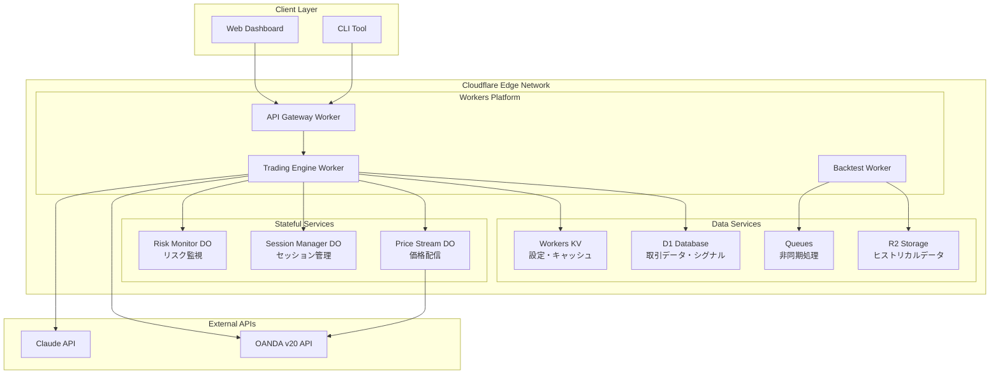
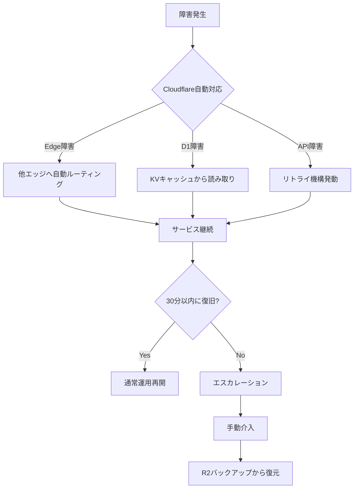
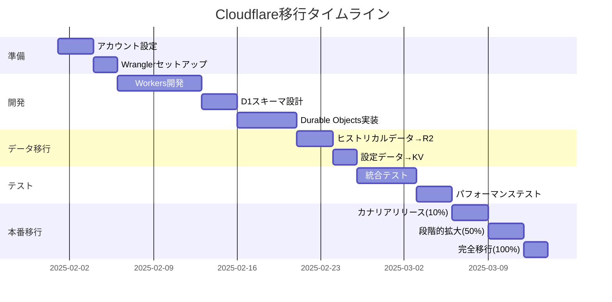

# FX取引システム インフラストラクチャ設計書（Cloudflare版）

## 1. 概要

### 1.1 目的
本設計書は、Cloudflareのエッジコンピューティングプラットフォームを中心としたFX取引システムのインフラストラクチャ設計を定義する。

### 1.2 設計方針
- **Cloudflareファースト**: Workers、D1、R2、Durable Objectsを最大活用
- **エッジネイティブ**: グローバル300+都市のエッジロケーションで超低レイテンシー実現
- **サーバーレス**: 運用負荷を最小化し、開発に集中
- **コスト最適化**: 月額$5からスタート可能、エグレス料金無料

## 2. インフラ要件

### 2.1 パフォーマンス要件
- **レイテンシー目標**:
  - ブローカーAPI応答: < 50ms
  - 指標計算処理: < 10ms
  - WebSocket通信: < 20ms
  - AI判断（Claude API）: < 100ms

- **処理能力**:
  - 同時監視通貨ペア: 3ペア
  - 1分あたり処理数: 最大180計算
  - WebSocket同時接続数: 50以上

### 2.2 データ要件
- **ストレージ**:
  - 時系列データ: 最低5年分（約100GB）
  - バックテストデータ: 2005年以降（約500GB）
  - ログデータ: 90日分ローテーション

- **帯域幅**:
  - インバウンド: 平均10Mbps、ピーク50Mbps
  - アウトバウンド: 平均5Mbps、ピーク20Mbps

### 2.3 可用性要件
- **SLA目標**: 99.5%（月間ダウンタイム3.6時間以内）
- **障害復旧時間（RTO）**: 1時間以内
- **データ損失許容時間（RPO）**: 5分以内

## 3. Cloudflareアーキテクチャ詳細

### 3.1 Cloudflareサービス構成

#### コアサービス
**月額コスト**: $5〜$50（使用量に応じて自動スケール）

**構成**:
```yaml
# 基本構成
Workers:
  plan: Paid ($5/月〜)
  requests: 10M requests included
  cpu_time: 30ms CPU time per request
  
D1_Database:
  rows_read: 5M included
  rows_written: 100K included
  storage: 5GB included
  
R2_Storage:
  storage: 10GB free
  class_a_operations: 1M/month free
  class_b_operations: 10M/month free
  egress: 無料（大きなメリット）
  
Durable_Objects:
  requests: 1M included
  duration: 400,000 GB-s included
  websocket_hibernation: 利用可能（コスト削減）
```

**メリット**:
- グローバルエッジネットワーク（低レイテンシー）
- WebSocket Hibernation APIによるコスト削減
- エグレス料金無料
- サーバーレスで運用負荷最小

**デメリット**:
- SQLiteベース（D1）のため大規模データには制限
- 従来型のVMベースシステムとの互換性

### 3.2 Cloudflare Workers（コンピュート層）

```typescript
// Workers設定例
export default {
  async fetch(request: Request, env: Env): Promise<Response> {
    // FX取引ロジック実行
    const tradingEngine = new TradingEngine(env);
    return await tradingEngine.process(request);
  },
  
  async scheduled(event: ScheduledEvent, env: Env): Promise<void> {
    // 定期実行タスク（1分足確定時の処理など）
    await processMinuteCandle(env);
  }
};
```

**特徴**:
- 0msコールドスタート
- グローバル300+都市で実行
- 自動スケーリング
- CPU時間課金（待機時間は無料）

### 3.3 D1 Database（データ層）

```sql
-- D1スキーマ設計
CREATE TABLE price_ticks (
  id INTEGER PRIMARY KEY AUTOINCREMENT,
  symbol TEXT NOT NULL,
  timestamp INTEGER NOT NULL,
  bid REAL NOT NULL,
  ask REAL NOT NULL,
  created_at TEXT DEFAULT CURRENT_TIMESTAMP
);

CREATE TABLE trading_signals (
  id TEXT PRIMARY KEY, -- 191^2-126形式
  timeframe TEXT NOT NULL,
  signal_type INTEGER NOT NULL,
  confidence REAL NOT NULL,
  metadata TEXT, -- JSON
  created_at TEXT DEFAULT CURRENT_TIMESTAMP
);

-- パフォーマンス最適化インデックス
CREATE INDEX idx_price_timestamp ON price_ticks(timestamp DESC);
CREATE INDEX idx_signals_timeframe ON trading_signals(timeframe, created_at DESC);
```

**特徴**:
- SQLiteベース（軽量高速）
- 読み取りレプリカ自動配置
- 5GB無料枠
- トランザクション対応

### 3.4 R2 Storage（オブジェクトストレージ）

```typescript
// R2使用例
class BacktestDataManager {
  async storeHistoricalData(bucket: R2Bucket, data: Buffer) {
    const key = `backtest/${new Date().toISOString()}/data.parquet`;
    await bucket.put(key, data, {
      httpMetadata: {
        contentType: 'application/parquet',
        cacheControl: 'max-age=31536000' // 1年キャッシュ
      }
    });
  }
  
  async getHistoricalData(bucket: R2Bucket, dateRange: DateRange) {
    const list = await bucket.list({
      prefix: `backtest/${dateRange.start}/`
    });
    // エグレス料金無料で大量データ取得可能
    return list;
  }
}
```

**特徴**:
- S3互換API
- エグレス料金完全無料（最大のメリット）
- 10GB無料枠
- 大容量バックテストデータ保存に最適

### 3.5 Durable Objects（ステートフル処理）

```typescript
// WebSocket管理用Durable Object
export class TradingSession implements DurableObject {
  private connections: Set<WebSocket> = new Set();
  
  async fetch(request: Request): Promise<Response> {
    if (request.headers.get('Upgrade') === 'websocket') {
      const [client, server] = new WebSocketPair();
      
      // WebSocket Hibernation APIでコスト削減
      this.ctx.acceptWebSocket(server);
      this.connections.add(server);
      
      return new Response(null, {
        status: 101,
        webSocket: client
      });
    }
  }
  
  async webSocketMessage(ws: WebSocket, message: string) {
    // リアルタイム価格配信
    const data = JSON.parse(message);
    await this.broadcast(data);
  }
  
  async webSocketClose(ws: WebSocket) {
    this.connections.delete(ws);
  }
}
```

**特徴**:
- グローバル一意性保証
- WebSocket Hibernation（アイドル時コスト削減）
- 強整合性ストレージ
- 自動地理的配置

## 4. Cloudflareネイティブアーキテクチャ

### 4.1 システム構成図



### 4.2 実装アーキテクチャ詳細

#### コンポーネント実装

```typescript
// wrangler.toml設定
name = "fx-trading-system"
main = "src/index.ts"
compatibility_date = "2024-01-01"

[[d1_databases]]
binding = "DB"
database_name = "fx-trading"
database_id = "xxxxxxxx-xxxx-xxxx-xxxx-xxxxxxxxxxxx"

[[r2_buckets]]
binding = "BACKTEST_DATA"
bucket_name = "fx-backtest-data"

[[kv_namespaces]]
binding = "CONFIG"
id = "xxxxxxxx-xxxx-xxxx-xxxx-xxxxxxxxxxxx"

[[durable_objects.bindings]]
name = "PRICE_STREAM"
class_name = "PriceStreamDO"

[[queues.producers]]
binding = "TRADE_QUEUE"
queue = "fx-trades"

[vars]
OANDA_API_URL = "https://api-fxtrade.oanda.com/v3"
CLAUDE_API_URL = "https://api.anthropic.com/v1"
```

#### API設計

```typescript
// API Gateway Worker
export default {
  async fetch(request: Request, env: Env): Promise<Response> {
    const url = new URL(request.url);
    
    // ルーティング
    switch (url.pathname) {
      case '/api/trade/execute':
        return handleTradeExecution(request, env);
      
      case '/api/signals/realtime':
        return handleWebSocketUpgrade(request, env);
      
      case '/api/backtest/run':
        return handleBacktestRequest(request, env);
      
      case '/api/metrics':
        return handleMetricsRequest(request, env);
      
      default:
        return new Response('Not Found', { status: 404 });
    }
  }
};
```

### 4.3 段階的実装計画

#### Phase 1: MVP（月額$5）
```yaml
cloudflare_services:
  workers:
    plan: Free (100,000 requests/day)
    scripts:
      - trading-engine
      - api-gateway
  
  d1:
    plan: Free (5GB storage, 5M rows read/month)
    databases:
      - fx-trading-dev
  
  kv:
    plan: Free (1GB storage, 100,000 reads/day)
    namespaces:
      - config
      - cache
  
  features:
    - 単一通貨ペア（USD/JPY）
    - 基本的な取引ロジック
    - 手動バックテスト
```

#### Phase 2: Production（月額$5〜25）
```yaml
cloudflare_services:
  workers:
    plan: Paid ($5/month minimum)
    requests: 10M included
    cpu_time: 30ms per request
  
  d1:
    rows_read: 25M/month
    rows_written: 50M/month
    storage: 10GB
  
  r2:
    storage: 100GB backtest data
    class_a_ops: 1M/month
    class_b_ops: 10M/month
  
  durable_objects:
    requests: 1M/month
    duration: 400,000 GB-s
    websocket_hibernation: enabled
  
  features:
    - 3通貨ペア対応
    - リアルタイムWebSocket配信
    - 自動バックテスト
    - AI判断統合
```

#### Phase 3: Scale（月額$50〜100）
```yaml
cloudflare_services:
  workers:
    smart_placement: enabled  # 自動最適配置
    logpush: enabled  # ログエクスポート
  
  d1:
    read_replicas: auto  # 自動レプリカ配置
    point_in_time_recovery: 30_days
  
  r2:
    storage: 1TB+
    multipart_uploads: enabled
    event_notifications: enabled
  
  analytics:
    workers_analytics_engine: enabled
    custom_metrics: unlimited
  
  features:
    - 10+通貨ペア
    - 複数戦略並列実行
    - リアルタイムダッシュボード
    - 高度なリスク管理
```

## 5. Cloudflareデプロイメント

### 5.1 Wrangler CLIを使用したデプロイ

```bash
# 開発環境セットアップ
npm install -g wrangler
wrangler login

# D1データベース作成
wrangler d1 create fx-trading
wrangler d1 execute fx-trading --file=./schema.sql

# KVネームスペース作成
wrangler kv:namespace create CONFIG
wrangler kv:namespace create CACHE

# R2バケット作成
wrangler r2 bucket create fx-backtest-data

# Workersデプロイ
wrangler deploy --env production
```

### 5.2 GitHub Actions CI/CD

```yaml
name: Deploy to Cloudflare

on:
  push:
    branches: [main]
  pull_request:
    branches: [main]

jobs:
  test:
    runs-on: ubuntu-latest
    steps:
      - uses: actions/checkout@v3
      - uses: actions/setup-node@v3
        with:
          node-version: '20'
      
      - name: Install dependencies
        run: npm ci
      
      - name: Run tests
        run: npm test
      
      - name: Type check
        run: npm run type-check

  deploy:
    needs: test
    if: github.ref == 'refs/heads/main'
    runs-on: ubuntu-latest
    
    steps:
      - uses: actions/checkout@v3
      
      - name: Deploy Workers
        uses: cloudflare/wrangler-action@v3
        with:
          apiToken: ${{ secrets.CLOUDFLARE_API_TOKEN }}
          accountId: ${{ secrets.CLOUDFLARE_ACCOUNT_ID }}
          command: deploy --env production
      
      - name: Run D1 Migrations
        uses: cloudflare/wrangler-action@v3
        with:
          apiToken: ${{ secrets.CLOUDFLARE_API_TOKEN }}
          command: d1 migrations apply fx-trading --env production
      
      - name: Upload Historical Data to R2
        uses: cloudflare/wrangler-action@v3
        with:
          apiToken: ${{ secrets.CLOUDFLARE_API_TOKEN }}
          command: r2 object put fx-backtest-data/historical.parquet --file=./data/historical.parquet
```

### 5.3 Cloudflare監視・分析

```typescript
// Workers Analytics Engineを使用したカスタムメトリクス
export class MetricsCollector {
  constructor(private env: Env) {}
  
  async recordTradeMetrics(trade: Trade) {
    // Analytics Engineにメトリクス送信
    await this.env.ANALYTICS.writeDataPoint({
      blobs: ['trade_executed'],
      doubles: [trade.profit, trade.executionTime],
      indexes: [trade.symbol, trade.strategy]
    });
  }
  
  async recordLatency(operation: string, latency: number) {
    await this.env.ANALYTICS.writeDataPoint({
      blobs: [operation],
      doubles: [latency],
      indexes: ['latency']
    });
  }
}

// Cloudflare Logsを使用したログ収集
export class LogManager {
  async logError(error: Error, context: any) {
    console.error(JSON.stringify({
      timestamp: new Date().toISOString(),
      level: 'ERROR',
      message: error.message,
      stack: error.stack,
      context
    }));
  }
  
  async logTrade(trade: Trade) {
    console.log(JSON.stringify({
      timestamp: new Date().toISOString(),
      level: 'INFO',
      type: 'TRADE',
      data: trade
    }));
  }
}
```

#### 監視ダッシュボード
```yaml
cloudflare_analytics:
  realtime:
    - Request count
    - Error rate
    - P50/P95/P99 latency
    - Bandwidth usage
    
  workers_analytics:
    - CPU time consumption
    - Duration metrics
    - Subrequest count
    
  custom_metrics:
    - Trade execution time
    - Signal generation latency
    - WebSocket connection count
    - Active trading sessions
    
  alerts:
    - Error rate > 1%
    - P99 latency > 100ms
    - CPU time > 50ms
    - Failed trades > 5/minute
```

## 6. Cloudflareセキュリティ

### 6.1 Cloudflareセキュリティ機能

```typescript
// Workersセキュリティ実装
export class SecurityMiddleware {
  async authenticate(request: Request, env: Env): Promise<boolean> {
    const apiKey = request.headers.get('X-API-Key');
    
    // Workers KVでAPIキー検証
    const validKey = await env.API_KEYS.get(apiKey);
    if (!validKey) return false;
    
    // Rate Limiting (組み込み)
    const clientId = request.headers.get('CF-Connecting-IP');
    const rateLimitKey = `rate_limit:${clientId}`;
    const requests = await env.RATE_LIMIT.get(rateLimitKey);
    
    if (requests && parseInt(requests) > 1000) {
      return false; // Rate limit exceeded
    }
    
    await env.RATE_LIMIT.put(rateLimitKey, 
      (parseInt(requests || '0') + 1).toString(),
      { expirationTtl: 60 }
    );
    
    return true;
  }
  
  async encryptSensitiveData(data: string, env: Env): Promise<string> {
    // Web Crypto APIを使用した暗号化
    const encoder = new TextEncoder();
    const dataBuffer = encoder.encode(data);
    
    const key = await crypto.subtle.importKey(
      'raw',
      encoder.encode(env.ENCRYPTION_KEY),
      { name: 'AES-GCM' },
      false,
      ['encrypt']
    );
    
    const iv = crypto.getRandomValues(new Uint8Array(12));
    const encrypted = await crypto.subtle.encrypt(
      { name: 'AES-GCM', iv },
      key,
      dataBuffer
    );
    
    return btoa(String.fromCharCode(...new Uint8Array(encrypted)));
  }
}
```

### 6.2 Cloudflareセキュリティ設定

```yaml
cloudflare_security:
  waf_rules:
    - OWASP Core Ruleset
    - Rate limiting: 1000 req/min per IP
    - Geo-blocking: 必要に応じて
    
  ddos_protection:
    mode: automatic
    sensitivity: high
    
  bot_management:
    challenge_suspicious: true
    block_malicious: true
    
  ssl_tls:
    mode: Full (Strict)
    min_version: TLS 1.3
    
  access_control:
    api_tokens:
      - read_only: analytics, logs
      - read_write: workers, d1, r2, kv
    
  secrets_management:
    # wrangler.tomlではなくWorkers Secretsを使用
    - OANDA_API_KEY
    - CLAUDE_API_KEY
    - ENCRYPTION_KEY
    - DATABASE_PASSWORD
```

### 6.2 データ保護
```yaml
data_protection:
  encryption:
    at_rest: AES-256
    in_transit: TLS 1.3
    
  backup:
    frequency: 日次
    retention: 30日
    location: 別リージョン
    
  compliance:
    - GDPR準拠
    - データレジデンシー考慮
```

## 7. Cloudflareコスト最適化

### 7.1 月額コスト詳細

| サービス | Free Tier | MVP ($5/月) | Production ($25/月) | Scale ($50-100/月) |
|---------|-----------|-------------|---------------------|--------------------|
| Workers | 100K req/day | 10M req/month | 50M req/month | Unlimited |
| D1 | 5GB, 5M reads | 10GB, 25M reads | 50GB, 100M reads | 500GB+, 1B+ reads |
| R2 | 10GB | 100GB | 500GB | 1TB+ |
| KV | 1GB, 100K reads | 10GB, 1M reads | 100GB, 10M reads | Unlimited |
| Durable Objects | - | 1M requests | 10M requests | 100M+ requests |
| Analytics | Basic | Enhanced | Custom metrics | Enterprise |

### 7.2 コスト削減戦略

```typescript
// WebSocket Hibernationでコスト削減
export class OptimizedDurableObject {
  async fetch(request: Request) {
    // Hibernation APIを活用
    if (request.headers.get('Upgrade') === 'websocket') {
      const [client, server] = new WebSocketPair();
      this.ctx.acceptWebSocket(server); // Hibernation有効
      return new Response(null, { status: 101, webSocket: client });
    }
  }
  
  // Hibernation中もWebSocketメッセージを処理
  async webSocketMessage(ws: WebSocket, message: string) {
    // 必要最小限の処理のみ実行
    // CPU時間を節約
  }
}

// D1クエリ最適化
class OptimizedDatabase {
  async efficientQuery(db: D1Database) {
    // インデックスを活用して読み取り行数を最小化
    const result = await db.prepare(`
      SELECT * FROM signals 
      WHERE timeframe = ? AND created_at > ?
      ORDER BY created_at DESC
      LIMIT 100
    `).bind('15M', oneHourAgo).all();
    
    // KVキャッシュでD1読み取りを削減
    await env.CACHE.put('recent_signals', JSON.stringify(result), {
      expirationTtl: 60
    });
  }
}

// R2エグレス無料を活用
class OptimizedStorage {
  async serveBacktestData(request: Request, env: Env) {
    // R2から直接データ配信（エグレス無料）
    const object = await env.BACKTEST_DATA.get('historical/2024.parquet');
    return new Response(object.body, {
      headers: {
        'Content-Type': 'application/parquet',
        'Cache-Control': 'public, max-age=3600'
      }
    });
  }
}
```

### 7.3 コスト監視

```yaml
cost_monitoring:
  daily_budget_alerts:
    workers: $1
    d1: $0.5
    r2: $0.5
    durable_objects: $1
    
  optimization_triggers:
    - CPU time > 30ms → コード最適化
    - D1 reads > 100M/month → キャッシュ戦略見直し
    - DO duration > 1M GB-s → Hibernation活用強化
```

## 8. Cloudflare災害復旧・事業継続性

### 8.1 Cloudflareネイティブレジリエンス

```typescript
// 自動フェイルオーバー実装
export class ResilienceManager {
  async handleFailure(error: Error, env: Env) {
    // Cloudflareのグローバルネットワークで自動フェイルオーバー
    if (error.message.includes('D1_ERROR')) {
      // D1障害時はKVキャッシュから読み取り
      return await this.fallbackToKVCache(env);
    }
    
    if (error.message.includes('OANDA_TIMEOUT')) {
      // ブローカーAPI障害時はリトライ
      return await this.retryWithExponentialBackoff(
        () => this.callOandaAPI(),
        { maxRetries: 5, initialDelay: 1000 }
      );
    }
  }
  
  async performBackup(env: Env) {
    // D1データをR2にバックアップ
    const backup = await env.DB.dump();
    const date = new Date().toISOString();
    await env.BACKTEST_DATA.put(
      `backups/d1/${date}.sql`,
      backup
    );
    
    // KV設定をR2にバックアップ
    const config = await env.CONFIG.list();
    await env.BACKTEST_DATA.put(
      `backups/kv/${date}.json`,
      JSON.stringify(config)
    );
  }
}
```

### 8.2 Cloudflareの高可用性機能

```yaml
cloudflare_resilience:
  global_network:
    locations: 300+ cities
    anycast: automatic routing
    failover: < 1 second
    
  data_durability:
    d1:
      replication: automatic
      point_in_time_recovery: 30 days
      backup_frequency: continuous
      
    r2:
      durability: 99.999999999% (11 9s)
      replication: multi-region
      versioning: available
      
    kv:
      replication: global
      eventual_consistency: ~60 seconds
      
    durable_objects:
      strong_consistency: guaranteed
      automatic_migration: on failure
      
  service_availability:
    workers: 99.99% SLA
    smart_placement: automatic optimization
    zero_downtime_deployment: blue-green
    
  backup_strategy:
    automated:
      - D1 continuous backup
      - R2 versioning
      - KV replication
      
    manual:
      - Daily export to R2
      - Weekly snapshot to external storage
      - Monthly full system backup
```

### 8.3 障害復旧プロセス



## 9. Cloudflare移行計画

### 9.1 段階的移行スケジュール



### 9.2 移行チェックリスト

```yaml
migration_checklist:
  phase1_preparation:
    - [ ] Cloudflareアカウント作成
    - [ ] APIトークン取得
    - [ ] Wrangler CLIインストール
    - [ ] GitHub Actionsシークレット設定
    
  phase2_development:
    - [ ] Workersスクリプト作成
    - [ ] D1データベーススキーマ
    - [ ] KVネームスペース設定
    - [ ] R2バケット作成
    - [ ] Durable Objects実装
    
  phase3_data_migration:
    - [ ] ヒストリカルデータエクスポート
    - [ ] R2へのデータアップロード
    - [ ] D1データインポート
    - [ ] KV設定移行
    
  phase4_testing:
    - [ ] 単体テスト
    - [ ] 統合テスト
    - [ ] パフォーマンステスト
    - [ ] セキュリティテスト
    
  phase5_production:
    - [ ] カナリアデプロイ
    - [ ] メトリクス監視
    - [ ] エラー率確認
    - [ ] 段階的トラフィック移行
    - [ ] 完全移行承認
```

### 9.3 ロールバック手順

```typescript
// ロールバック実装
class RollbackManager {
  async performRollback(env: Env) {
    // 1. トラフィックを旧環境にルーティング
    await this.updateDNS('old-system.example.com');
    
    // 2. Workersを以前のバージョンにロールバック
    await this.deployPreviousVersion(env.PREVIOUS_VERSION);
    
    // 3. データベースをバックアップから復元
    await this.restoreFromBackup(env.BACKUP_TIMESTAMP);
    
    // 4. アラート通知
    await this.notifyRollback('Rollback completed');
  }
}
```

## 10. まとめ

### Cloudflareを選ぶ理由

1. **超低レイテンシー**: グローバル300+都市のエッジで実行
2. **コスト効率**: 月$5から始められ、エグレス無料
3. **サーバーレス**: インフラ管理不要で開発に集中
4. **自動スケーリング**: トラフィックに応じて自動拡張
5. **統合プラットフォーム**: Workers, D1, R2, KV, DOを統一環境で利用

### FX取引システムとの親和性

- **リアルタイム性**: WebSocket Hibernationで効率的な価格配信
- **グローバル対応**: 世界中の取引所に低レイテンシーでアクセス
- **データ分析**: R2で大量のヒストリカルデータをコスト効率的に保存
- **API統合**: WorkersからOANDA/Claude APIへのシームレスな接続

---

最終更新日：2025年1月
バージョン：2.0（Cloudflare版）