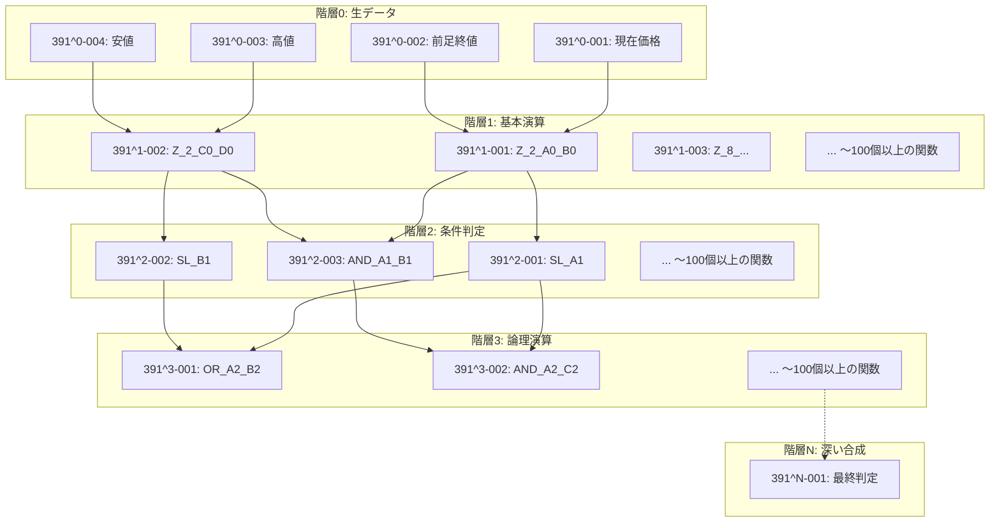

# PKG DAGアーキテクチャの厳密なルール

## ⚠️ 重要な原則（これを間違えないこと）

### 1. 階層参照の絶対ルール

**階層Nのノードは、階層N-1以下のノードのみを参照できる**

```
❌ 間違い: 同じ階層内で横の参照がある
✅ 正解: 参照は必ず下位階層に向かってのみ（DAGの本質）
```

#### 参照可能性の表：
| 階層 | 参照可能な階層 | 説明 |
|------|----------------|------|
| 階層0 | なし | 生データ層（参照元なし） |
| 階層1 | 階層0のみ | 生データのみ参照可能 |
| 階層2 | 階層0, 1 | 階層1の結果と生データを参照可能 |
| 階層3 | 階層0, 1, 2 | 階層2以下すべて参照可能 |
| 階層N | 階層0〜N-1 | 自分より下のすべての階層を参照可能 |

### 2. 階層の深さについて

**階層は3つや4つで終わりではない**

```
❌ 間違い: 階層0→1→2→3で完結
✅ 正解: 関数合成の深さに応じて階層は無限に深くなりうる
```

#### なぜ深くなるか：
- 各階層で新しい抽象度の処理が追加される
- 関数が関数の結果を使い、それがさらに別の関数の入力になる
- この連鎖が続く限り階層は深くなる

### 3. PKG IDの構造理解

```
391^2-126
 │││ │  └─ 連番: その階層内での通し番号（1〜数百）
 │││ └──── 階層: 0=生データ, 1以降=関数層（上限なし）
 ││└────── 通貨: 1=USDJPY, 2=EURUSD, 3=EURJPY, 9=共通
 │└─────── 周期: 9=共通, 1-8=TSML周期
 └──────── 時間足: 1=1分, 2=5分, 3=15分, 4=30分, 5=1時間, 6=4時間, 9=共通
```

**重要**: 連番126は「階層2に126個目の関数がある」ことを示す。各階層には数十〜数百の関数が存在可能。

### 4. 実際のDAG構造例



### 5. よくある実装の間違い

#### ❌ 間違い例1: 階層を固定する
```python
# 間違い
class PKGSystem:
    def __init__(self):
        self.layer1 = [...]  # 基本判定
        self.layer2 = [...]  # 統合判定
        self.layer3 = [...]  # 最終判定（ここで終わり）
```

#### ✅ 正しい実装: 動的な階層
```python
# 正しい
class PKGSystem:
    def __init__(self):
        self.nodes = {}  # 階層数に制限なし
        # 391^1-001から391^N-XXXまで動的に追加
```

#### ❌ 間違い例2: 横の参照を許可
```python
# 間違い
nodes['391^2-001'].dependencies = ['391^2-002']  # 同階層を参照
```

#### ✅ 正しい実装: 下位階層のみ参照
```python
# 正しい
nodes['391^2-001'].dependencies = ['391^1-001', '391^1-002']  # 階層1を参照
nodes['391^3-001'].dependencies = ['391^2-001', '391^1-003']  # 階層2と1を参照
```

### 6. メモファイルとの整合性

メモファイルに登場する記述：
- 「191^2-126」→ 階層2に126番の関数が存在
- 「関数型DAG」→ 有向非巡環グラフ、循環参照なし
- 「階層依存」→ 上位階層は下位階層のみ参照

これらは**深い階層構造**と**各階層内の多数の関数**を示している。

### 7. 実装チェックリスト

PKG実装時に必ず確認すること：

- [ ] 階層数に上限を設けていないか？
- [ ] 同階層間の参照を防いでいるか？
- [ ] 各階層に多数のノード（数十〜数百）を配置可能か？
- [ ] 依存関係が下位階層のみを向いているか？
- [ ] 関数合成の深さに応じて階層が増えるか？

---

## まとめ

PKG DAGは：
1. **階層は深い**（3〜4層ではなく、数十層以上になりうる）
2. **横の参照はない**（同階層間の参照は禁止）
3. **各階層には多数のノード**（連番が100を超えることも普通）
4. **厳密な階層構造**（上位は下位のみ参照）

この原則を守ることで、正しいPKG DAGアーキテクチャが実装できる。