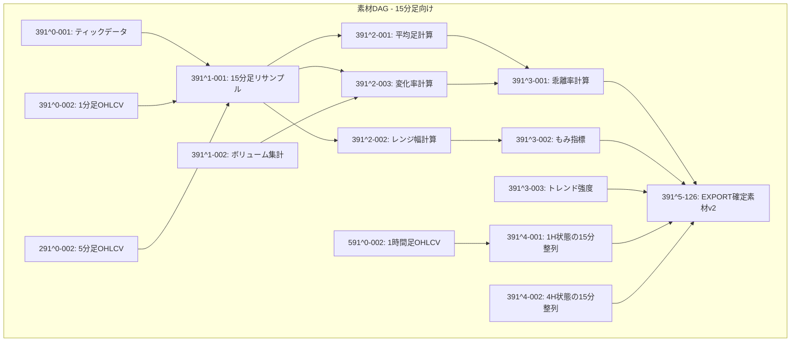
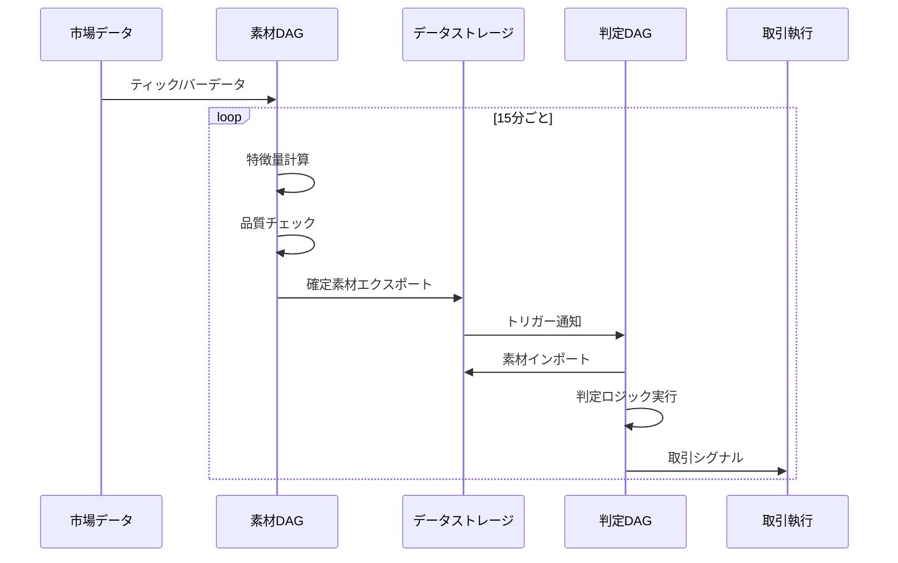

# PKG二段DAGアーキテクチャ設計書

## 1. アーキテクチャ選択：素材DAGと判定DAGの分離

### 1.1 二段DAG構成の理由

FX取引システムにおいて、以下の理由から**素材DAG**と**判定DAG**を分離する：

1. **再利用性**: 同じ素材（特徴量）を複数の時間足判定で共有
2. **変更の局所化**: 素材の改修が判定ロジックに波及しない
3. **スケーラビリティ**: 素材計算と判定を独立してスケール
4. **テスト性**: 素材の品質テストと判定ロジックテストを分離

### 1.2 素材DAGと判定DAGの目的の違い

#### 素材DAG（安定層）
- **目的**: 市場データから普遍的な特徴量を抽出
- **変更頻度**: **低い**（一度作ったら基本的に触らない）
- **最適化対象**: 計算効率とデータ品質
- **バージョニング**: 破壊的変更は新バージョンとして並走

#### 判定DAG（探索層）
- **目的**: 収益を最大化する判定ロジックの発見
- **変更頻度**: **高い**（バックテストで頻繁に調整）
- **最適化対象**: 収益性とリスク調整後リターン
- **探索手法**: 分岐探索、パラメータ最適化、論理合成の組み替え

### 1.3 PKGルールの遵守

二段DAG構成でも、各DAG内では厳密にPKGルールを守る：
- **階層参照ルール**: 上位階層は下位階層のみ参照（横参照禁止）
- **DAG間参照**: データエクスポート/インポートによる片方向参照のみ

## 2. 素材DAG（Feature DAG）

### 2.1 目的と責務

**目的**: 取引判定に必要な全ての特徴量を計算し、確定素材として出力

**責務**:
- 生データの取得と正規化
- テクニカル指標の計算
- マルチタイムフレームデータの整列
- データ品質の保証

### 2.2 素材DAGの構造



### 2.3 エクスポート仕様

```python
# 素材DAGのエクスポートスキーマ
EXPORT_SCHEMA = {
    "timestamp": "datetime",      # 15分足のクローズ時刻
    "symbol": "string",          # 通貨ペア
    
    # 基本価格情報
    "open": "float",
    "high": "float", 
    "low": "float",
    "close": "float",
    "volume": "float",
    
    # 計算済み指標
    "ha_open": "float",          # 平均足始値
    "ha_close": "float",         # 平均足終値
    "range_width": "float",      # レンジ幅
    "change_rate": "float",      # 変化率
    "kairi_rate": "float",       # 乖離率
    
    # もみ・トレンド指標
    "momi_score": "float",       # もみスコア（0-1）
    "trend_strength": "float",   # トレンド強度（-1〜1）
    
    # マルチタイムフレーム
    "trend_1h": "int",           # 1時間足トレンド（1:上,2:下,3:中立）
    "trend_4h": "int",           # 4時間足トレンド
    
    # メタ情報
    "is_bar_closed": "boolean",  # バー確定フラグ
    "data_quality": "float"      # データ品質スコア
}
```

## 3. 判定DAG（Decision DAG）

### 3.1 目的と責務

**目的**: 確定素材を入力として、最終的な取引判定を出力

**責務**:
- 素材のインポートと検証
- 取引ロジックの実行
- リスク管理ルールの適用
- 最終シグナルの生成

### 3.2 判定DAGの構造

```mermaid
graph TD
    subgraph "判定DAG - 15分足取引"
        %% 階層0: インポート層（素材DAGから）
        B0_1[import://391^5-126@v2]
        
        %% 階層1: 品質ゲート
        B1_1[391^1-011: データ品質チェック]
        B1_2[391^1-012: バー確定確認]
        
        %% 階層2: 基本判定
        B2_1[391^2-051: もみ判定]
        B2_2[391^2-052: トレンド判定]
        B2_3[391^2-053: 乖離判定]
        
        %% 階層3: 複合判定
        B3_1[391^3-091: 同逆判定]
        B3_2[391^3-092: 行帰パターン]
        B3_3[391^3-093: ブレイクアウト判定]
        
        %% 階層4: リスク評価
        B4_1[391^4-121: ポジション管理]
        B4_2[391^4-122: 連続損失チェック]
        
        %% 階層5以降: 統合判定の深い階層
        B5_1[391^5-151: AND条件統合]
        B6_1[391^6-181: OR条件統合]
        B7_1[391^7-201: 優先順位判定]
        
        %% 階層N: 最終判定
        BN_1[391^15-301: 最終シグナル]
    end
    
    B0_1 --> B1_1
    B0_1 --> B1_2
    
    B1_1 --> B2_1
    B1_2 --> B2_1
    B1_1 --> B2_2
    B1_1 --> B2_3
    
    B2_1 --> B3_1
    B2_2 --> B3_1
    B2_3 --> B3_1
    B2_2 --> B3_2
    B2_1 --> B3_3
    
    B3_1 --> B5_1
    B3_2 --> B5_1
    B3_3 --> B6_1
    
    B4_1 --> B7_1
    B4_2 --> B7_1
    B5_1 --> B7_1
    B6_1 --> B7_1
    
    B7_1 --> BN_1
```

### 3.3 判定ロジックの実装例

```python
# 階層2: もみ判定（391^2-051）
def momi_judgment(imported_data):
    """
    インポートした素材からもみ状態を判定
    """
    momi_score = imported_data['momi_score']
    range_width = imported_data['range_width']
    
    if momi_score > 0.7 or range_width < 0.3:
        return 3  # もみ（待機）
    return 0  # もみなし

# 階層3: 同逆判定（391^3-091）
def dokyaku_judgment(momi_result, trend_result, kairi_result):
    """
    複数の基本判定を統合して同逆判定
    """
    if momi_result == 3:
        return 3  # もみなら待機
    
    if trend_result == kairi_result:
        return trend_result  # 一致なら方向確定
    
    # 乖離があれば転換の可能性
    if kairi_result != 0:
        return 3 if trend_result == 1 else 1
    
    return 3  # デフォルト待機
```

## 4. DAG間の契約とデータフロー

### 4.1 エクスポート/インポート契約

```yaml
# contract.yaml
export_contract:
  name: "feature_export_15m"
  version: "v2"
  schema_version: "1.0.0"
  
  timing:
    frequency: "15min"
    delay_tolerance: "30s"
    
  data_quality:
    missing_rate_threshold: 0.01
    outlier_detection: true
    
  partitioning:
    - timestamp (15min boundary)
    - symbol
    - is_bar_closed
    
  retention:
    hot_storage: "7days"
    cold_storage: "5years"
```

### 4.2 データパイプライン



## 5. 実装上の考慮事項

### 5.1 階層数の目安

| DAG種別 | 典型的な階層数 | 理由 |
|---------|---------------|------|
| 素材DAG | 5〜10層 | データ変換と集計が中心 |
| 判定DAG | 10〜20層以上 | 複雑な論理合成が必要 |

### 5.2 ノード数の目安

| 階層 | 素材DAG | 判定DAG |
|------|---------|---------|
| 階層1 | 10〜30 | 5〜10 |
| 階層2 | 30〜50 | 20〜40 |
| 階層3 | 20〜40 | 50〜100 |
| 階層4以降 | 10〜20 | 100〜200 |

### 5.3 バージョン管理

```python
# バージョン並走の例
FEATURE_VERSIONS = {
    "v1": "391^5-125",  # 旧バージョン（廃止予定）
    "v2": "391^5-126",  # 現行バージョン
    "v3-beta": "391^5-127"  # テスト中
}

def get_feature_import(version="v2"):
    """バージョン指定でインポート"""
    return f"import://{FEATURE_VERSIONS[version]}"
```

## 6. テスト戦略

### 6.1 素材DAGのテスト

```python
# 契約テスト
def test_feature_export_contract():
    """エクスポートが契約を満たすか検証"""
    exported_data = load_export("391^5-126")
    
    # スキーマ検証
    assert_schema_match(exported_data, EXPORT_SCHEMA)
    
    # 統計的検証
    assert exported_data['momi_score'].between(0, 1).all()
    assert exported_data['trend_strength'].between(-1, 1).all()
    
    # 時間整合性
    assert exported_data['timestamp'].is_15min_boundary().all()
```

### 6.2 判定DAGのテスト

```python
# ロジックテスト
def test_decision_logic():
    """判定ロジックの回帰テスト"""
    # モック素材データ
    mock_features = create_mock_features(scenario="trending_up")
    
    # 判定実行
    decision_dag = DecisionDAG()
    signal = decision_dag.evaluate(mock_features)
    
    # 期待値検証
    assert signal == 1  # 上昇シグナル期待
```

## 7. 移行計画

### 7.1 段階的移行

1. **Phase 1**: 既存の単一DAGから素材部分を特定
2. **Phase 2**: 素材DAGを新規構築（既存と並走）
3. **Phase 3**: 判定DAGを素材DAG依存に切り替え
4. **Phase 4**: 旧実装を廃止

### 7.2 切り替え基準

| 条件 | しきい値 | アクション |
|------|---------|-----------|
| 他時間足判定の追加 | 2系統以上 | 二段DAG検討 |
| 素材ノード数 | 50以上 | 分離推奨 |
| バックテスト時間 | 10分以上 | 分離必須 |
| チーム規模 | 3人以上 | 分離推奨 |

## 8. バックテストによる判定DAGの最適化

### 8.1 分岐探索の戦略

判定DAGは収益最大化のために頻繁に調整される：

```python
# 判定DAGの分岐探索例
class DecisionDAGOptimizer:
    def explore_branches(self, base_dag, historical_data):
        """判定DAGの分岐を探索して最適な構成を発見"""
        
        variations = []
        
        # 1. 閾値パラメータの探索
        for momi_threshold in [0.5, 0.6, 0.7, 0.8]:
            dag_variant = base_dag.copy()
            dag_variant.set_parameter("391^2-051", "threshold", momi_threshold)
            variations.append(dag_variant)
        
        # 2. 論理合成パターンの探索
        logic_patterns = [
            "AND(dokyaku, ikikaeri)",  # 保守的
            "OR(dokyaku, ikikaeri)",   # 積極的
            "MN([dokyaku, ikikaeri, breakout])"  # 優先順位
        ]
        
        for pattern in logic_patterns:
            dag_variant = base_dag.copy()
            dag_variant.replace_node("391^5-151", pattern)
            variations.append(dag_variant)
        
        # 3. バックテスト実行
        results = []
        for variant in variations:
            performance = backtest(variant, historical_data)
            results.append({
                "dag": variant,
                "sharpe": performance.sharpe_ratio,
                "return": performance.total_return,
                "max_dd": performance.max_drawdown
            })
        
        # 4. 最適な構成を選択
        return max(results, key=lambda x: x["sharpe"])
```

### 8.2 素材DAGの安定性 vs 判定DAGの探索性

| 側面 | 素材DAG | 判定DAG |
|------|---------|---------|
| **変更理由** | データ品質改善、新データソース追加 | 収益性向上、リスク削減 |
| **変更頻度** | 月1回程度 | 日次〜週次 |
| **テスト方法** | 統計的品質検証 | バックテスト、フォワードテスト |
| **最適化手法** | なし（品質基準の遵守のみ） | グリッドサーチ、ベイズ最適化、遺伝的アルゴリズム |
| **バージョン管理** | 長期安定版を維持 | A/Bテスト、段階的ロールアウト |

### 8.3 判定DAGの探索可能な要素

1. **ノード構成の変更**
   - 新しい判定ロジックの追加/削除
   - 階層構造の組み替え

2. **パラメータ調整**
   - 閾値の最適化
   - 重み係数の調整
   - 時間窓の変更

3. **論理合成パターン**
   - AND/OR/XORの組み合わせ変更
   - 優先順位（MN関数）の調整
   - 条件分岐（SL関数）の追加

4. **リスク管理ルール**
   - ポジションサイズの調整
   - 損切り/利確レベルの最適化
   - 連続損失ルールの変更

## 9. まとめ

### 推奨アーキテクチャ

**素材DAG（安定層） → 判定DAG（探索層）** の二段構成により：

1. **PKGルール遵守**: 各DAG内で階層参照ルールを厳守
2. **再利用性向上**: 安定した素材を複数の判定で共有
3. **探索効率向上**: 判定ロジックのみを高速に探索
4. **リスク分離**: 素材の安定性を保ちながら判定を最適化

### 重要な原則

#### DAG構造の原則
- DAG間は**データ参照のみ**（関数呼び出し禁止）
- 各DAG内では**横参照禁止**
- 階層は**必要に応じて深く**（10層以上は普通）
- 各階層に**多数のノード**（100個以上も可）

#### 運用の原則
- **素材DAG**: 一度作ったら基本的に触らない（安定性重視）
- **判定DAG**: バックテストで積極的に探索（収益性重視）
- **契約管理**: 素材のスキーマ変更は新バージョンとして並走
- **探索記録**: 判定DAGの全ての変更とパフォーマンスを記録

---

作成日: 2025年1月
バージョン: 1.0.0