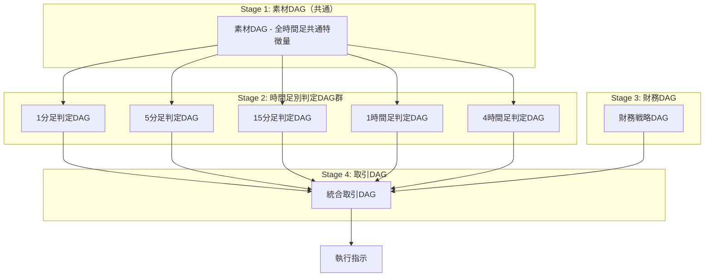

# PKGマルチタイムフレーム取引アーキテクチャ設計書

## 1. 4段階DAGアーキテクチャ概要

### 1.1 全体構成



### 1.2 各DAGの役割

| DAG種別 | 役割 | 更新頻度 | 出力 |
|---------|------|----------|------|
| 素材DAG | 全時間足共通の特徴量計算 | ティック/1分 | 標準化された特徴量 |
| 時間足別判定DAG | 各時間足でのエントリー判定 | 各バー確定時 | 方向シグナル(1/2/3) |
| 財務DAG | リスク・資金管理 | ポジション変更時 | ポジションサイズ、SL/TP |
| 取引DAG | 全体統合と最終判断 | 任意のDAG更新時 | 執行指示 |

## 2. 時間足別判定DAGの設計

### 2.1 PKG ID体系の拡張

```python
# 時間足別判定DAGのID体系
# [時間足][周期][通貨]^[階層]-[連番]

# 1分足判定DAG（階層20-29）
191^20-001  # 1分足もみ判定
191^21-001  # 1分足同逆判定
191^22-001  # 1分足シグナル

# 5分足判定DAG（階層30-39）
291^30-001  # 5分足もみ判定
291^31-001  # 5分足同逆判定
291^32-001  # 5分足シグナル

# 15分足判定DAG（階層40-49）
391^40-001  # 15分足もみ判定
391^41-001  # 15分足同逆判定
391^42-001  # 15分足シグナル

# 1時間足判定DAG（階層50-59）
591^50-001  # 1時間足もみ判定
591^51-001  # 1時間足同逆判定
591^52-001  # 1時間足シグナル

# 4時間足判定DAG（階層60-69）
691^60-001  # 4時間足もみ判定
691^61-001  # 4時間足同逆判定
691^62-001  # 4時間足シグナル
```

### 2.2 判定DAGの出力仕様

```python
# 各時間足判定DAGの統一出力フォーマット
DECISION_OUTPUT_SCHEMA = {
    "timestamp": "datetime",      # バー確定時刻
    "timeframe": "string",       # 時間足（1M/5M/15M/1H/4H）
    "signal": "int",             # 1=買い, 2=売り, 3=待機
    "strength": "float",         # シグナル強度（0-1）
    "confidence": "float",       # 信頼度（0-1）
    
    # 判定根拠
    "momi_state": "int",         # もみ状態
    "dokyaku_result": "int",     # 同逆判定結果
    "ikikaeri_pattern": "int",   # 行帰パターン
    "breakout_detected": "bool", # ブレイクアウト有無
    
    # メタ情報
    "is_valid": "boolean",       # 有効な判定か
    "expires_at": "datetime"     # 判定の有効期限
}
```

## 3. 財務DAGの設計

### 3.1 財務DAGのPKG ID体系

```python
# 財務DAG（階層100-119）
991^100-001  # 口座残高取得
991^101-001  # 現在リスク計算
991^102-001  # 最大ポジション数判定
991^103-001  # Kelly基準計算
991^104-001  # ポジションサイズ決定
991^105-001  # SL/TP計算
991^110-001  # リスクリワード評価
```

### 3.2 財務DAGの階層構造

```python
class FinancialDAGStructure:
    """財務DAGの階層構造"""
    
    # 階層100: ポートフォリオ状態
    LAYER_100 = {
        "991^100-001": "口座残高",
        "991^100-002": "既存ポジション総額",
        "991^100-003": "未実現損益",
        "991^100-004": "本日実現損益"
    }
    
    # 階層101: リスク評価
    LAYER_101 = {
        "991^101-001": "VAR計算",  # Value at Risk
        "991^101-002": "最大ドローダウン",
        "991^101-003": "相関リスク",
        "991^101-004": "集中リスク"
    }
    
    # 階層102: ポジションサイジング
    LAYER_102 = {
        "991^102-001": "Kelly基準",
        "991^102-002": "固定比率法",
        "991^102-003": "ボラティリティ調整",
        "991^102-004": "最適F"
    }
    
    # 階層103: 執行パラメータ
    LAYER_103 = {
        "991^103-001": "エントリー価格",
        "991^103-002": "ストップロス",
        "991^103-003": "テイクプロフィット",
        "991^103-004": "トレーリングストップ"
    }
```

## 4. 取引DAG（最終統合）の設計

### 4.1 取引DAGの役割

取引DAGは以下を統合して最終的な執行指示を生成：

1. **複数時間足シグナルの統合**
2. **財務戦略の適用**
3. **優先順位付けと競合解決**
4. **執行タイミングの決定**

### 4.2 取引DAGのPKG ID体系

```python
# 取引DAG（階層200-299）
991^200-001  # 時間足シグナル収集
991^201-001  # シグナル整合性チェック
991^202-001  # 優先順位判定
991^203-001  # 財務制約適用
991^204-001  # 執行可否判定
991^205-001  # 最終執行指示生成
```

### 4.3 取引DAGの実装例

```python
# src/pkg/trading_dag.py

class TradingDAG:
    """取引DAG: 全体を統合する最上位DAG"""
    
    def __init__(self):
        self.timeframe_weights = {
            '1M': 0.05,   # スキャルピング
            '5M': 0.15,   # 短期
            '15M': 0.30,  # メイン
            '1H': 0.30,   # 中期
            '4H': 0.20    # 長期トレンド
        }
        
    def evaluate(self, timeframe_signals, financial_params, market_state):
        """
        取引DAG評価
        
        Args:
            timeframe_signals: 各時間足からのシグナル辞書
            financial_params: 財務DAGからのパラメータ
            market_state: 現在の市場状態
        """
        
        # 階層200: シグナル収集と検証
        valid_signals = self._collect_valid_signals(timeframe_signals)
        
        # 階層201: 整合性チェック
        alignment_score = self._check_alignment(valid_signals)
        
        # 階層202: 優先順位判定（MN関数的アプローチ）
        priority_signal = self._determine_priority(valid_signals, alignment_score)
        
        # 階層203: 財務制約適用
        if not self._check_financial_constraints(financial_params):
            return {'action': 'skip', 'reason': 'financial_constraints'}
        
        # 階層204: 執行可否判定
        execution_score = self._calculate_execution_score(
            priority_signal, 
            alignment_score, 
            financial_params
        )
        
        # 階層205: 最終執行指示
        if execution_score > 0.7:  # 閾値
            return self._generate_execution_order(
                signal=priority_signal,
                financial=financial_params,
                score=execution_score
            )
        
        return {'action': 'wait', 'score': execution_score}
    
    def _check_alignment(self, signals):
        """時間足間の整合性をチェック"""
        
        # 全時間足が同じ方向を示しているか
        directions = [s['signal'] for s in signals.values() if s['signal'] != 3]
        
        if not directions:
            return 0.0
        
        # 方向の一致度を計算
        if len(set(directions)) == 1:
            return 1.0  # 完全一致
        
        # 重み付き一致度
        weighted_sum = 0
        total_weight = 0
        main_direction = max(set(directions), key=directions.count)
        
        for tf, signal in signals.items():
            weight = self.timeframe_weights[tf]
            if signal['signal'] == main_direction:
                weighted_sum += weight
            total_weight += weight
        
        return weighted_sum / total_weight if total_weight > 0 else 0
    
    def _determine_priority(self, signals, alignment_score):
        """優先シグナルを決定（PKGのMN関数的アプローチ）"""
        
        # 優先度スコア計算
        priority_scores = {}
        
        for tf, signal in signals.items():
            if signal['signal'] != 3:  # 待機以外
                # 基本スコア = 重み × 強度 × 信頼度
                base_score = (
                    self.timeframe_weights[tf] * 
                    signal.get('strength', 0.5) * 
                    signal.get('confidence', 0.5)
                )
                
                # 整合性ボーナス
                if alignment_score > 0.8:
                    base_score *= 1.5
                
                priority_scores[tf] = (base_score, signal)
        
        if not priority_scores:
            return None
        
        # 最高スコアのシグナルを選択
        best_tf = max(priority_scores, key=lambda k: priority_scores[k][0])
        return priority_scores[best_tf][1]
    
    def _generate_execution_order(self, signal, financial, score):
        """最終的な執行指示を生成"""
        
        return {
            'action': 'execute',
            'side': 'buy' if signal['signal'] == 1 else 'sell',
            'size': financial['position_size'],
            'entry': financial['entry_price'],
            'stop_loss': financial['stop_loss'],
            'take_profit': financial['take_profit'],
            'timeframe_source': signal['timeframe'],
            'confidence': score,
            'execution_time': 'immediate',
            'order_type': 'market',
            
            # メタデータ
            'meta': {
                'signal_strength': signal['strength'],
                'alignment_score': score,
                'risk_amount': financial['risk_amount'],
                'expected_reward': financial['expected_reward']
            }
        }
```

## 5. 統合システムの実装

### 5.1 全体フロー

```python
# src/pkg/integrated_multi_timeframe_system.py

class IntegratedMultiTimeframeSystem:
    """マルチタイムフレーム統合取引システム"""
    
    def __init__(self):
        # Stage 1: 素材DAG
        self.feature_dag = FeatureDAG()
        
        # Stage 2: 時間足別判定DAG
        self.decision_dags = {
            '1M': DecisionDAG(timeframe='1M'),
            '5M': DecisionDAG(timeframe='5M'),
            '15M': DecisionDAG(timeframe='15M'),
            '1H': DecisionDAG(timeframe='1H'),
            '4H': DecisionDAG(timeframe='4H')
        }
        
        # Stage 3: 財務DAG
        self.financial_dag = FinancialDAG()
        
        # Stage 4: 取引DAG
        self.trading_dag = TradingDAG()
        
        # シグナルキャッシュ（有効期限付き）
        self.signal_cache = {}
    
    def process_tick(self, tick_data, portfolio_state):
        """
        ティックデータから執行指示まで
        """
        
        # 1. 素材DAGで特徴量を計算
        features = self.feature_dag.process(tick_data)
        
        # 2. 各時間足のバー確定をチェックし、判定DAGを実行
        timeframe_signals = self._update_timeframe_signals(features)
        
        # 3. いずれかの時間足でシグナルが更新されたら
        if timeframe_signals:
            # 財務DAGでパラメータ計算
            financial_params = self.financial_dag.evaluate(
                portfolio_state, 
                self._get_active_signals()
            )
            
            # 取引DAGで最終判断
            execution_order = self.trading_dag.evaluate(
                self._get_active_signals(),
                financial_params,
                features
            )
            
            if execution_order['action'] == 'execute':
                return execution_order
        
        return {'action': 'wait'}
    
    def _update_timeframe_signals(self, features):
        """時間足別のシグナルを更新"""
        updated = {}
        
        for tf in ['1M', '5M', '15M', '1H', '4H']:
            if features[f'is_{tf}_closed']:
                # 該当時間足の判定DAGを実行
                signal = self.decision_dags[tf].evaluate(features)
                
                # キャッシュに保存（有効期限付き）
                self.signal_cache[tf] = {
                    'signal': signal,
                    'timestamp': features['timestamp'],
                    'expires_at': self._calculate_expiry(tf)
                }
                
                updated[tf] = signal
        
        return updated
    
    def _get_active_signals(self):
        """有効期限内のシグナルを取得"""
        active = {}
        current_time = datetime.now()
        
        for tf, cached in self.signal_cache.items():
            if cached['expires_at'] > current_time:
                active[tf] = cached['signal']
        
        return active
    
    def _calculate_expiry(self, timeframe):
        """シグナルの有効期限を計算"""
        expiry_minutes = {
            '1M': 5,
            '5M': 15,
            '15M': 30,
            '1H': 120,
            '4H': 480
        }
        
        return datetime.now() + timedelta(minutes=expiry_minutes[timeframe])
```

## 6. パフォーマンス最適化

### 6.1 並列処理

```python
# 時間足別判定DAGは並列実行可能
from concurrent.futures import ThreadPoolExecutor

class ParallelDecisionEvaluator:
    """並列判定評価器"""
    
    def evaluate_all_timeframes(self, features):
        with ThreadPoolExecutor(max_workers=5) as executor:
            futures = {}
            
            for tf, dag in self.decision_dags.items():
                if features[f'is_{tf}_closed']:
                    futures[tf] = executor.submit(dag.evaluate, features)
            
            results = {}
            for tf, future in futures.items():
                results[tf] = future.result(timeout=0.1)  # 100ms timeout
            
            return results
```

### 6.2 実行時間目標

| DAG種別 | 目標実行時間 | 最大許容時間 |
|---------|------------|------------|
| 素材DAG | < 5ms | 10ms |
| 判定DAG（各） | < 10ms | 20ms |
| 財務DAG | < 5ms | 10ms |
| 取引DAG | < 10ms | 20ms |
| **合計** | **< 30ms** | **60ms** |

## 7. バックテストでの最適化戦略

### 7.1 階層的最適化

```python
class HierarchicalOptimizer:
    """階層的最適化：各DAGを独立して最適化"""
    
    def optimize(self, historical_data):
        # 1. 素材DAGは固定（最適化しない）
        
        # 2. 各時間足判定DAGを独立最適化
        for tf in ['1M', '5M', '15M', '1H', '4H']:
            self.optimize_decision_dag(tf, historical_data)
        
        # 3. 財務DAGを最適化
        self.optimize_financial_dag(historical_data)
        
        # 4. 取引DAG（統合重み）を最適化
        self.optimize_trading_weights(historical_data)
```

### 7.2 時間足の重み最適化

```python
def optimize_timeframe_weights(historical_data):
    """時間足の重みを最適化"""
    
    best_weights = None
    best_sharpe = -999
    
    # グリッドサーチ
    for w1 in [0.05, 0.10, 0.15]:
        for w5 in [0.10, 0.15, 0.20]:
            for w15 in [0.25, 0.30, 0.35]:
                for w60 in [0.25, 0.30, 0.35]:
                    w240 = 1.0 - (w1 + w5 + w15 + w60)
                    
                    if w240 < 0 or w240 > 0.3:
                        continue
                    
                    weights = {
                        '1M': w1, '5M': w5, '15M': w15, 
                        '1H': w60, '4H': w240
                    }
                    
                    sharpe = backtest_with_weights(historical_data, weights)
                    
                    if sharpe > best_sharpe:
                        best_sharpe = sharpe
                        best_weights = weights
    
    return best_weights
```

## 8. まとめ

### 8.1 アーキテクチャの利点

1. **モジュール性**: 各DAGが独立して開発・最適化可能
2. **スケーラビリティ**: 時間足の追加が容易
3. **リスク管理**: 財務DAGで一元管理
4. **柔軟性**: 取引DAGで様々な統合戦略を実装可能

### 8.2 重要な設計原則

1. **PKGルール遵守**: 横参照なし、階層的依存のみ
2. **ステートレス**: 各DAGは純粋関数として実装
3. **並列実行**: 時間足別判定は並列処理
4. **キャッシュ活用**: シグナルは有効期限付きでキャッシュ

### 8.3 次のステップ

1. 各時間足判定DAGの詳細実装
2. 財務DAGのリスク管理ロジック精緻化
3. 取引DAGの統合アルゴリズム開発
4. バックテスト環境での検証

---

作成日: 2025年1月
バージョン: 1.0.0